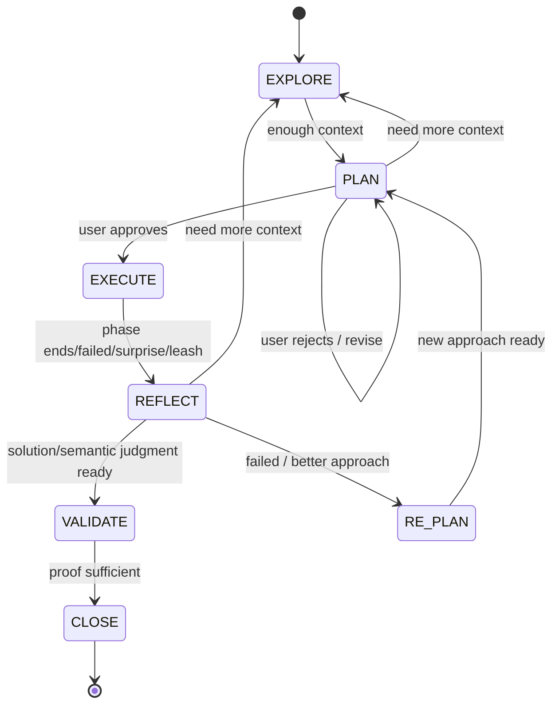

# Iterative Planner

**Core Principle**: Context Window = RAM. Filesystem = Disk.
Write to disk immediately. The context window will rot. The files won't.

**Doctrine**: Loop First, Determinism Second, Generalize Last.
The core loop is `EXPLORE → PLAN → EXECUTE → REFLECT → VALIDATE → CLOSE`, with `REFLECT → RE-PLAN/EXPLORE` still available when the solution is wrong or semantically incoherent.
Deterministic scripts support that loop, mistake registries preserve memory, and generalized guards should only be promoted after real recurrence.

## Quick Reference: Gate Transitions

> **ALL transitions use ONE command.** Do NOT run verify_gate, checklist_runner, or project_health individually at gate points.

| # | Gate | Command | Key Requirements |
|---|------|---------|-----------------|
| 1 | `explore-to-plan` | `node <sp>/scripts/transition.mjs explore-to-plan` | ≥3 findings, KB read, intent contract for user-facing goals |
| 2 | `plan-to-execute` | `node <sp>/scripts/transition.mjs plan-to-execute` | Problem stmt, files list, user approved, deliverable mapping, criterion/story linkage, verification obligation synthesis + context-sensitive verification matrix for recipe/orchestration/integration work |
| 3 | `execute-to-reflect` | `node <sp>/scripts/transition.mjs execute-to-reflect` | Red-team notes (≥3 vectors) + persona audit |
| 4 | `reflect-to-validate` | `node <sp>/scripts/transition.mjs reflect-to-validate` | Reflection verdicts, semantic coherence, KB/semantic upkeep, progress complete |
| 5 | `validate-to-close` | `node <sp>/scripts/transition.mjs validate-to-close` | Proof of work, verification sufficiency, persona audit, intent/test evidence |
| 6 | `notify-user` | `node <sp>/scripts/transition.mjs notify-user` | Final handoff audit (available from VALIDATE or CLOSE; reachability audit disabled) |

**`<sp>`** = `.agent/skills/iterative-planner`

- **Gate chain (I-015)**: Gates must run in order (1→2→3→4→5). Skipping a gate triggers Prolog invariant I-015.
- **Transition nonce**: Each successful transition writes a nonce to `state.json`. The next gate verifies it — direct `state.md` edits are detected and blocked.
- **Approval nonce**: Gate 1 generates a nonce. Before Gate 2 passes, the nonce must appear as `[APPROVED:<nonce>]` in `decisions.md`. In default `auto` mode, `transition.mjs explore-to-plan` writes it directly. In `interactive` mode, use `approval_daemon.mjs` or `nonce_reveal.mjs`. In `multi-agent` mode, the story review agent writes the approval marker after reviewing findings coverage.
- **KB digest**: At EXPLORE, read all KB files, then persist the KB digest salt in `findings_ledger.json` (`kb_digest_salt`) or add `[KB_DIGEST:<hash>]` to `findings.md` (salt shown by Gate 1). Proves KB was actually read.
- **Content depth**: Findings need ≥30 words each. Red-team vectors need ≥3 content lines each. Empty code blocks don't count as proof of work.
- **FAIL = blocked**: Fix all FAIL items before proceeding. WARN = advisory.
- **Deterministic repair packet**: When a gate blocks and prints `Deterministic Repair Packet`, follow that packet before guessing at prose. It names the target artifact, missing section shape, diagnostic commands, loop-recovery command, and retry transition.
- **Paste output**: Always paste the transition command output into the conversation so the user can see it.
- **Verification obligation synthesis**: If repo/task context, ontology signals, persona signals, or touched boundaries imply operational verification risk, `plan.md` must include `## Verification Obligation Synthesis` with `Repo/system context`, `Task shape`, `Ontology signals`, `Persona signals`, `System boundaries touched`, and `Derived verification obligations`. This section is where discovery context becomes an explicit verification contract.
- **Context-sensitive verification**: If the plan touches recipe/orchestration/browser/integration/backend operational behavior, `## Verification Strategy` must be a table with `Criterion | Story linkage | Repo/system context | Required proof type | Concrete command or action | Pass means | What remains unverified`. The matrix should justify the proof mode from the changed system and from the synthesized obligations; do not treat wrapper/unit tests as production proof by default. Frontend/browser work should propose real rendered-journey proof and screenshot/captured-viewport artifacts using proof IDs such as `proof:browser_journey`, `proof:browser_screenshot`, and `proof:visual_proof` when those are locally feasible. A `## Success Criteria` markdown table is valid when it includes a `Criterion` column; `Verification Strategy` criterion cells may use stable IDs such as `sc_1` instead of copying full prose, and proof wording may be natural prose when it matches a canonical proof family, so do not force exact `proof:*` tokens as a formatting ritual.
- **Matrix diagnostics**: When `GATE-PLN-017` is unclear, run `node .agent/skills/iterative-planner/scripts/verification_matrix.mjs lint --plan <plan-dir> --json` to inspect the selected table, parsed criteria count, row family matches, recognized `proof:*` IDs, malformed rows, synthesized-obligation coverage, and the shared `Evidence guidance` packet without changing planner state.
- **Low-level agent gate packet**: When `verify_gate.mjs plan-to-execute` blocks, read the printed `Low-Level Agent Gate Packet` before editing prose. It names exact schema/list fields for `intent_contract.json`, unresolved story IDs, required `Verification Obligation Synthesis` labels, matrix columns, shared evidence guidance, and deterministic lint/repair commands. Treat that packet as the short prompt for smaller agents; do not duplicate it by hand in every user prompt.
- **Evidence guidance surfaces**: `bootstrap.mjs status`, `verification_matrix.mjs lint`, and the blocked `plan-to-execute` packet render the same analyzer-derived `Evidence guidance`. Use it before authoring matrix evidence; copied placeholder/example cells are intentionally rejected as incomplete proof.
- **Closeout reporting**: When verification-obligation synthesis is active, `verification.md` must record `## Systems Exercised`, `## Remaining Unverified`, and `## Verification Sufficiency`, and the `Validation Status` ladder must stop leaving the required proof levels at `PENDING`.
- **KB sign-off at REFLECT**: `reflection.md` includes a prefilled `## Knowledge Base Sign-Off` section. Leave it pending until REFLECT, then either update `plans/knowledge/` for real reusable learnings or set `Decision: no_new_learnings` with a specific `Reason:`. Do not edit `state.json.close_signals`; that JSON is generated by the planner from artifacts.
- **Compliance audit**: `node <sp>/scripts/gate_compliance.mjs` — reports which gates were run/skipped.

**`{plan-dir}`** = `plans/plan_YYYY-MM-DD_XXXXXXXX/` (active plan directory under project root).
**Discovery**: `plans/.current_plan` contains the plan directory name. One active plan at a time.
**Cross-plan context**: `plans/FINDINGS.md` and `plans/DECISIONS.md` persist across plans (merged on close).
**Cross-plan context entrypoint**: start with `plans/INDEX.md`, then use `plans/FINDINGS.md` and `plans/DECISIONS.md` for deep dives.
**Long-term memory**: `plans/knowledge/` accumulates mistakes, patterns, and gotchas across all plans (updated at close, read at explore).
**Intent capture**: `plans/<plan>/intent_contract.json` records user, JTBD, anti-goals, and required deliverables for user-facing or deliverable-heavy work. Internal planner-maintenance goals should remain `NOT_REQUIRED` unless the goal text clearly carries real audience or user-facing deliverable obligations. Gates 1, 2, and 5 enforce the required path.

## When to Use This (vs. Lightweight Flow)

| Situation | Use |
|-----------|-----|
| Multi-file changes (3+ files) | **Iterative Planner** |
| Migrations, refactors, audit remediations | **Iterative Planner** |
| New feature pipeline / major component | **Iterative Planner** |
| Tasks that have already failed once | **Iterative Planner** |
| Cross-system work (2+ systems) | **Iterative Planner** |
| Scientific / quant / data-modeling work — TrueSkill, Markov, backtests, calibration, data lineage, coverage, temporal split, leakage checks | **Iterative Planner** with scientific shape. EXPLORE must record assumption probes before PLAN treats data claims as true. |
| Roadmaps spanning multiple epics, tickets, migrations, dependencies, or child plans | **Program Manager** first, then child Iterative Planner plans |
| Debugging with unclear root cause | **Iterative Planner** |
| Confirming prior fixes / re-verifying state (>50% findings pre-fixed) | **Lightweight** with triage file as plan |
| Single-file fixes, obvious solutions | **Lightweight** (task.md → implementation_plan.md → walkthrough.md) |
| Single-file static/UI/page-clone deliverables | **Lightweight** |
| Quick feature / extraction | **Lightweight** |
| Known-root-cause bug fixes | **Lightweight** |
| History-poisoned or abandoned plan where the remaining work is now simple | **Lightweight** after `recover-poison` or `abandon` |
| **Operational chores** — ad budget changes, credential rotations, settings toggles, schedule edits, content tweaks, dashboard configuration | **Skip the planner entirely.** Just do the task and commit. If `bootstrap.mjs new` is run anyway, it will detect `chore` shape and minimise gates, but the planner state machine is overkill — chores aren't engineering work. |
| **Questions** — "what does X do?", "how is Y wired?", "why is Z failing?" | **Skip the planner — answer the user.** The state machine is for tracking work; questions don't need a plan. Run `bootstrap.mjs triage "<goal>"` first if unsure. |
| **Analysis tasks** — review / audit / explain / inspect / list / summarize, with no code-change verbs | **Skip the planner or use lightweight.** Detected as `analysis` shape with minimal gates. Run `bootstrap.mjs triage "<goal>"` to get a recommendation before opening anything. |

**Trigger phrases**: *"plan this"*, *"figure out"*, *"help me think through"*, *"I've been struggling with"*, *"debug this complex issue"*

**Autonomous batch trigger**: *"fix these autonomously"*, *"audit loop"*, *"turbo mode"*, *"run unattended"*, *"batch fix"* — see Autonomous Batch Mode section.

### Deterministic Preflight

Before choosing between the lightweight flow, the full planner, or poisoned-plan recovery, run:

```bash
node <sp>/scripts/planner_preflight.mjs --goal "<goal>" --json
```

If an active plan already exists, you can omit `--goal` and let the preflight classify the current plan context.

The returned contract is the shared routing surface used by `/safe-plan`, `/safe-change`, `/safe-change-power`, and `/advisor`:
- `flow.mode`
- `evidence.mode`
- `workflow.recommended` + `escalation_reason`
- `recovery.mode` + recovery command
- `anti_ritual`
- `authority_profile`
- `task_profile`
- `semantic_upkeep`
- `validation_bundle`
- `strictness_mode`
- `audit_posture`
- `recommended_path`
- `persona_activation_authority`

### Async Cheap-LLM Drift Steward

Planner drift can be reviewed by a secondary OpenAI-compatible LLM without making that model a gate authority.

Configure the provider with:

```bash
export PLANNER_DRIFT_LLM_API_KEY="..."
export PLANNER_DRIFT_LLM_MODEL="..."
export PLANNER_DRIFT_LLM_BASE_URL="https://provider.example/v1"
export PLANNER_DRIFT_LLM_TIMEOUT_MS=20000
export PLANNER_DRIFT_LLM_PHASES=gate,post_task
export PLANNER_DRIFT_LLM_WRITE_MODE=safe_apply
```

For local development, the drift client also reads a gitignored `.env.local`
from the project root as a fallback. Use the planner-specific variables above,
or use `DEEPSEEK_API_KEY` by itself to select the DeepSeek defaults:
`PLANNER_DRIFT_LLM_MODEL=deepseek-chat` and
`PLANNER_DRIFT_LLM_BASE_URL=https://api.deepseek.com/v1`. Explicit process
environment variables always win over `.env.local`, and missing provider
configuration remains fail-open advisory.

Useful commands:

```bash
node <sp>/scripts/llm_drift_auditor.mjs --mode gate --gate plan-to-execute --json
node <sp>/scripts/llm_drift_maintenance.mjs enqueue --plan <plan-dir> --reason post_task
node <sp>/scripts/llm_drift_maintenance.mjs run --job plans/<plan-dir>/async/<job>.json
```

Rules:
- Gate-time drift audit is advisory and fail-open. Missing config, invalid JSON, timeout, HTTP error, or `stale_blocking` output cannot fail a gate by itself.
- Provider calls request OpenAI-compatible JSON-object mode. If a provider answers with malformed JSON, the shared client makes one bounded JSON repair retry before returning fail-open `unavailable`.
- Async maintenance may safe-apply deterministic report regeneration, but LLM-suggested `@planner:proves`, `@planner:story`, story registry, ontology, or user-claim edits are review artifacts unless deterministic validation proves they are unambiguous.
- Every async report includes ontology usage proof from annotation validation, ontology serialization, invariant checks, story verification, story registry validation, and the traceability audit pack.
- If ontology facts change but no audit, gate, traceability, story, or rule-engine decision changes, classify the change as `ritual_only`.

### Program Manager Layer

Use `/program-manager` when the request is roadmap/program-shaped rather than one
implementation plan. It creates or updates a Program Packet at:

```text
plans/programs/<program-id>/program_packet.json
```

Generic idea, backlog, GitHub Issue, and GitHub Project intake also belongs here.
Draft local tickets first:

```bash
node <sp>/scripts/program_manager.mjs init --program <program-id> --title "<program title>" --goal "<program goal>" --json
node <sp>/scripts/program_manager.mjs intake --program <program-id-or-path> --from-text "<idea>" --json
node <sp>/scripts/program_manager.mjs intake --program <program-id-or-path> --from-text "<idea>" --title "<short title>" --ticket-type quant_exploration --persona-review --json
node <sp>/scripts/program_manager.mjs intake --program <program-id-or-path> --from-text "<idea>" --auto-story --write --json
node <sp>/scripts/program_manager.mjs intake --program <program-id-or-path> --from-file <path> --write --json
node <sp>/scripts/program_manager.mjs intake --program <program-id-or-path> --from-json-array '[{"title":"Quant exploration","type":"quant_exploration","persona_review":true,"text":"US-079: Explore target semantics"},{"title":"Code refactor","ticket_type":"code_refactor","persona_review":true,"text":"US-079: Refactor parser boundaries"}]' --write --json
node <sp>/scripts/program_manager.mjs intake --program <program-id-or-path> --issue <n> --repo owner/name --json
node <sp>/scripts/program_manager.mjs intake --program <program-id-or-path> --project-item <id-or-url> --repo owner/name --write --json
```

Use `init` when the Program Packet does not exist yet; it writes the valid empty
schema skeleton and refuses accidental overwrite unless `--force` is passed.
Intake is dry-run by default. `--write` updates only the local Program Packet and
the local `intake/<ticket-id>_intake_packet.json` artifact. Text and file intake
sources are mirrored as `external_refs` kinds `local_text` and `local_file`;
GitHub issue/project sources use `github_issue` and `github_project_item`.
Use `--title` for long single-ticket text bodies; if the derived title is longer
than 70 characters and no explicit title exists, intake tries a redacted cheap
LLM summary and falls back to a concise deterministic title. Use
`--from-json-array` for bulk discrete tickets. Use `--ticket-type` to record a
specialized lane while preserving the schema-safe base `type`; for example
`quant_exploration` maps to `research` and `code_refactor` maps to `refactor`.
Use `--persona-review` to attach advisory persona-review metadata, and
`--persona-packs <csv>` to override default packs. JSON-array items may set
`ticket_type` or `type`, `persona_review`, and `persona_packs`; item metadata
overrides CLI defaults for mixed programs. Use `--auto-story` when storyless
intake should append review-needed `NOT_IMPLEMENTED` draft stories to
`reports/user_story_audit/story_registry.json` and link those IDs to the ticket
without marking it ready.
Each intake result emits a **Ticket Intake Receipt** with the `/program-manager`
front door, source/action, Program Packet path, ticket id, traceability refs,
acceptance-criteria refs, verification refs, deterministic status, advisory
DeepSeek status, ticket type, persona review status/packs, recurrence
status/counts, quant persona gate status when applicable, and next required
command. Intake packets include
`retro_recurrence_check`; trusted active mistakes and
retro-promoted obligations can block tickets until the required guards or
evidence are present. Quant-shaped intake also includes a deterministic
`quant_persona_gate`; missing what-happened overview, target/outcome, data
lineage, temporal/leakage handling, controls, or quant verification rows keeps
the ticket blocked regardless of DeepSeek output. Agents should surface that
receipt before creating, reviewing, or publishing any GitHub ticket. GitHub
publication is separate and explicit:

```bash
node <sp>/scripts/github_ticket_review.mjs publish --program <program-id-or-path> --ticket <ticket-id> --repo owner/name --json
node <sp>/scripts/github_ticket_review.mjs publish --program <program-id-or-path> --ticket <ticket-id> --repo owner/name --project <id-or-url> --write --json
```

Do not create GitHub tickets directly from an idea/backlog prompt. Create or
update the local Program Packet ticket first with `program_manager.mjs intake`,
surface the Ticket Intake Receipt, then publish with `github_ticket_review.mjs
publish` only when GitHub should mirror the local ticket.

Validate with:

```bash
node <sp>/scripts/program_manager.mjs check --program plans/programs/<program-id>/program_packet.json
node <sp>/scripts/program_manager.mjs check --program plans/programs/<program-id>/program_packet.json --remediate --json
node <sp>/scripts/program_manager.mjs verify design-to-ready --program plans/programs/<program-id>/program_packet.json
node <sp>/scripts/program_manager.mjs verify ready-to-execution --program plans/programs/<program-id>/program_packet.json
node <sp>/scripts/program_manager.mjs verify execution-to-program-validate --program plans/programs/<program-id>/program_packet.json
node <sp>/scripts/program_manager.mjs verify validate-to-program-close --program plans/programs/<program-id>/program_packet.json
```

`--remediate` on `check` or `verify` translates blocked-ticket advisory
`recommended_actions` into local remediation task packets. Dry-run is default;
`--write` writes a `remediation/remediation_<timestamp>.json` artifact. The CLI
does not directly spawn Codex subagents and cannot override deterministic packet
status.

Ticket-centered GitHub review uses the Program Packet as truth and GitHub as the
visible mirror:

```bash
node <sp>/scripts/github_ticket_review.mjs review --issue <n> --program <program-id-or-path> --ticket <ticket-id> --json
node <sp>/scripts/github_ticket_review.mjs review --project-item <project-item-id-or-url> --program <program-id-or-path> --ticket <ticket-id> --write --json
```

Dry-run is the default. `--write` is required before the command edits the
Program Packet, writes `reviews/<ticket-id>_review_packet.json`, posts/updates a
GitHub issue comment, applies planner lifecycle labels, or updates a GitHub
Project Status field. It still will not close an issue unless
`--close-github-issue` is passed. The command records ticket `external_refs`
for GitHub mirrors plus local intake sources, `review_artifacts`, `github_sync`,
and deterministic `last_review_status`.
The metadata contract includes ticket `external_refs`, `review_artifacts`, `github_sync`, and deterministic `last_review_status`.
Review and publish results also emit a Ticket Intake Receipt so the handoff
shows the local ticket, deterministic status, advisory status, and GitHub mirror
action that were used. Review Packets and GitHub review comments include a
**Retro Recurrence Check** section before advisory findings so retros are
predictive ticket guards, not only closeout history.
Quant-shaped Review Packets and comments also include a **Quant Persona Gate**
section. DeepSeek sees that deterministic gate in its packet and may critique
the risk, but it cannot clear missing quant/persona evidence or call a blocked
ticket verified.
DeepSeek may classify the Review Packet as advisory (`needs_story`,
`needs_annotation`, `needs_verification`, `ontology_conflict`, `blocked`,
`review_ready`), but deterministic Program Packet, story, annotation, ontology,
and test evidence remains authoritative.

Program gates are additive and do not add states to the iterative planner state machine.
Missing Program Packets return `SKIP`. Executable tickets become child iterative plans
when they touch migration, delete/move work, shared/core surfaces, user-facing capability
behavior, cross-system dependencies, public interfaces, planner-core files, or anything
beyond artifact-only administrative scope.

### Commit Message Guard

Planner release, phase, feature, fix, and chore commits should install the portable `commit-msg` hook:

```bash
node .agent/skills/iterative-planner/scripts/planner.mjs install-hook commit-msg
```

The hook invokes `commit_msg_check.mjs`, which requires guarded commit subjects to include `Why:`, `What:`, and `Proof:` body headings. Emergency bypass remains `PLANNER_ALLOW_EMPTY_BODY=1`, and every bypass is logged for later review.

`planner_findings.mjs --json` extends that route with:
- `anti_ritual`
- `proof_posture`
- `phase_contract`
- `phase_profiles.reflect`
- `phase_profiles.validate`
- `adversarial_profile`
- `suggested_attack_vectors`

`knowledge_resolver.mjs --json` extends discovery with:
- `symmetry_hunts`
- `adversarial_profile`
- `suggested_attack_vectors`
- `related_retros`
- optional red-team artifact awareness via `reports/red_team_audit/anti_patterns.json`

### Phase Authority Model

The planner is intentionally asymmetric by phase:

- `EXPLORE`: agent primary, personas widen discovery, ontology stays advisory
- `PLAN`: agent primary, personas challenge assumptions, ontology enforces contracts
- `EXECUTE`: agent primary, personas/ontology stay boundary-only; do not add continuous EXECUTE-time second-guessing. The hard quant persona gate still runs at phase boundaries for quant-shaped work.
- `REFLECT`: agent primary, personas challenge solution quality, ontology checks semantic coherence and required upkeep
- `VALIDATE`: agent primary, personas challenge proof sufficiency, ontology checks proof consistency and waiver honesty
- `CLOSE`: agent primary, handoff integrity wins over tidy prose; the final bundle must agree with the validated result

This keeps the original simple loop intact. The planner should help the agent notice missed risk and step back safely, not supervise every keystroke.

### Approval Mode

The approval mode controls who writes `[APPROVED:<nonce>]` to `decisions.md` after a successful `explore-to-plan`.

- In default `auto` mode, `transition.mjs explore-to-plan` writes it directly.
- In `auto` mode (default), no extra PLAN-phase user action is needed.
- Default full workflows use `approval.mode = "auto"`, so do **not** tell the user to start the approval daemon unless the project has explicitly switched to `interactive` mode.

### Lightweight Invocation (via /safe-change)

When triggered by the `/safe-change` workflow for changes ≤3 files / ≤30 lines / no new abstractions, or when the remaining work after poisoned-plan recovery is now small and local:

1. **Start approval daemon** — spawn in background: `node <sp>/scripts/approval_daemon.mjs --auto &`. This auto-approves the plan-to-execute gate so the workflow runs without interruption (only for nonces tagged `safe-change`).
2. **Set workflow type** — when running explore-to-plan transition, set: `_PLANNER_WORKFLOW_TYPE=safe-change node <sp>/scripts/transition.mjs explore-to-plan`. This tags the nonce so the daemon knows it's safe to auto-approve.
3. **Skip bootstrap** — do NOT run `bootstrap.mjs`. Use the standard artifact files (`task.md`, `implementation_plan.md`, `walkthrough.md`) instead of `plans/` state files.
4. **EXPLORE lite** — still required, but write findings directly to `implementation_plan.md` instead of `findings.md`. Minimum 3 grep/search calls.
5. **PLAN** — write `implementation_plan.md` (user-facing). Auto-approve if ≤3 files.
6. **EXECUTE** — TDD: write invariant test first. Implement. Run test. Run full suite.
7. **REFLECT** — verify test count ≥ baseline + 1. Check for regressions.
8. **CLOSE** — write `walkthrough.md`. If `plans/knowledge/` exists, append learnings. If not, embed learnings in walkthrough under "## Lessons Learned".

Pure static UI/page deliverables (for example a standalone HTML clone) should use structured manual validation when the intent contract marks the work as `manual_observation`; do not invent a fake test file just to satisfy planner bureaucracy.

This avoids the overhead of the full state machine for simple, well-scoped changes while still enforcing TDD and regression gates.

## Integration with Existing Artefacts

When the iterative planner is active, the agent should:
- **Still update `task.md`** (top-level progress tracking) — keep the high-level bullet points in sync with `progress.md`
- **Use `plans/` for detailed state** — the state machine files (`state.md`, `plan.md`, `decisions.md`, etc.) live here
- **Write `implementation_plan.md`** if the user requests a formal plan review — the iterative planner's `plan.md` is the working plan; `implementation_plan.md` is the user-facing summary
- **Write `summary.md` at CLOSE** — summarise what was done; this is the canonical close artifact for the full flow. (The legacy `walkthrough.md` fallback for KB evidence in full plans was retired in v7.1+; it remains the canonical close artifact only for the lightweight `/safe-change` flow.)

## Supporting Utilities

These supporting scripts are part of the planner's canonical surface and should stay documented when they change:

- `knowledge_resolver.mjs` — deterministic routing and knowledge discovery for workflows, recipes, and repo-first scans
- `retro_registry.mjs` — read-only retro archive retrieval for `list`, `show`, `search`, `related-mistake`, and `active-for-plan`
- `planner_findings.mjs` — one-shot deterministic findings bundle for route, semantic blockers, repairable variance, telemetry-derived proof gaps, and semantic-substrate gaps including missing semantic substrate, with active-plan annotation scans scoped to `## Files To Modify` plus nearby real-code adjacency
- `planner_hygiene.mjs` — compact low-token cleanup surface that buckets planner findings into `auto_fix`, `needs_decision`, and `defer`, now including additive `anti_ritual` drift visibility. Treat it as optional expert triage and advisor input, not as mandatory ritual; anti-ritual warnings stay advisory unless backed by real semantic/proof/integrity risk.
- `knowledge_benchmark.mjs` — golden and real-project benchmark runner for route/tier/deep-search behavior
- `annotation_assist.mjs` — assisted bootstrapper for `@planner:` annotation suggestions and apply flows
- `persona_adapt.mjs` — read-only persona fit/usage scanner plus explicit `apply --safe` for high-confidence additive seed-role upgrades
- `semantic_maintenance.mjs` — fleet semantic-health scanner and explicit safe repair layer for host-owned persona, annotation, telemetry, workflow-history, and semantic-backlog drift
- `pre_commit_policy.mjs` — scoped planner commit-blocking policy used by the hook surface
- `pre-commit-hook.sh` — shell entrypoint that invokes planner pre-commit enforcement
- `post_tool_use.mjs` — lightweight hook for Codex/IDE tool-trace capture and compact proof telemetry when the environment supports it

Planner-core work in this repo should treat `config/planner_manifesto.json` as the machine-readable north star and `references/planner-manifesto.md` as the human-readable mirror. The manifesto is intentionally narrow: semantic risk can hard-block, known wording variance should canonicalize before blocking, ontology should challenge reasoning rather than replace it, impact beats ritual, and warnings stay advisory unless they are backed by real semantic/proof/integrity risk.

## State Machine



| State | Purpose | Allowed Actions |
|-------|---------|------------------|
| EXPLORE | Gather context | Read-only on project. Write only to `{plan-dir}`. |
| PLAN | Design approach | Write plan.md. NO code changes. |
| EXECUTE | Implement step-by-step | Edit files, run commands, write code. |
| REFLECT | Evaluate solution + semantics | Read outputs, compare against intended outcome, write `reflection.md`, update decisions.md. |
| VALIDATE | Evaluate proof sufficiency | Read `verification.md`, check exercised systems and remaining risk, prepare for close. |
| RE-PLAN | Revise direction | Log pivot in decisions.md. Do NOT write plan.md yet. |
| CLOSE | Finalise | Write summary.md. Audit decision anchors. Merge findings/decisions to consolidated files. |

`## Files To Modify` should use raw path-only bullets. The shared reader also tolerates common recovery forms such as code-spanned bullets and `### [NEW] path/to/file` headings, but that tolerance is for keeping scope from collapsing to ambient dirty files — not a replacement for the canonical bullet format.

### Transitions

| From → To | Trigger |
|-----------|---------|
| EXPLORE → PLAN | Sufficient context. ≥3 indexed findings in the effective findings source. |
| PLAN → EXPLORE | Can't state problem, can't list files, or insufficient findings. |
| PLAN → PLAN | User rejects plan. Revise and re-present. |
| PLAN → EXECUTE | User explicitly approves. |
| EXECUTE → REFLECT | Execution phase ends (all steps done, failure, surprise, or leash hit). |
| REFLECT → VALIDATE | Reflection says the solution and semantic upkeep are ready for proof challenge. |
| VALIDATE → CLOSE | Validation says proof is sufficient for the task profile. |
| REFLECT → RE-PLAN | Failure or better approach found. |
| REFLECT → EXPLORE | Need more context before re-planning. |
| RE-PLAN → PLAN | New approach formulated. Decision logged. |

Every transition → log in `state.md`. RE-PLAN transitions → also log in `decisions.md` (what failed, what learned, why new direction).
At CLOSE → audit decision anchors (`references/decision-anchoring.md`). Refresh `plans/INDEX.md`, then merge per-plan findings/decisions to `plans/FINDINGS.md` and `plans/DECISIONS.md`.

### Mandatory Re-reads (CRITICAL)

These files are active working memory. Re-read during the conversation, not just at start.

| When | Read | Why |
|------|------|-----|
| Before any EXECUTE step | `state.md`, `plan.md`, `progress.md`, `persona_guidance.md` | Confirm step, manifest, fix attempts, progress sync, domain guidance |
| Before writing a fix | `decisions.md` | Don't repeat failed approaches. Check 3-strike. |
| Before modifying `DECISION`-commented code | Referenced `decisions.md` entry | Understand why before changing |
| Before PLAN or RE-PLAN | `decisions.md`, `findings.md`, `findings_ledger.json`, `findings/*`, `persona_constraints.md`, `persona_guidance.md` | Ground plan in known facts + domain constraints |
| Before any REFLECT | `plan.md` (criteria), `progress.md`, `verification.md` | Compare against written criteria, not vibes |
| Every 10 tool calls | `state.md` | Reorient. Right step? Scope crept? |
| Every 15 tool calls during EXECUTE | `plan.md` (current step) | Drift check — is current activity aligned with plan step? |

**>50 messages**: re-read `state.md` + `plan.md` before every response. Files are truth, not memory.

## Bootstrapping

Stable dispatcher:

```bash
node <skill-path>/scripts/planner.mjs status
node <skill-path>/scripts/planner.mjs new "goal"
node <skill-path>/scripts/planner.mjs resume
node <skill-path>/scripts/planner.mjs gate <gate-name>
node <skill-path>/scripts/planner.mjs verify-fleet --json
```

```bash
node <skill-path>/scripts/bootstrap.mjs "goal"              # Create new plan (backward-compatible)
node <skill-path>/scripts/bootstrap.mjs new "goal"           # Create new plan
node <skill-path>/scripts/bootstrap.mjs new --force "goal"   # Close active plan, create new one
node <skill-path>/scripts/bootstrap.mjs resume               # Re-entry summary for new sessions
node <skill-path>/scripts/bootstrap.mjs status               # One-line state summary
node <skill-path>/scripts/bootstrap.mjs recover-poison       # Recover a history-poisoned plan into a safe successor
node <skill-path>/scripts/bootstrap.mjs close                # Close plan (preserves directory)
node <skill-path>/scripts/bootstrap.mjs close --informational # Close from any state (merges findings/KB, no execution needed)
node <skill-path>/scripts/bootstrap.mjs list                 # Show all plan directories
```

**Self-heal + install health (v3.10.2):** `bootstrap.mjs` and `transition.mjs` still run the built-in-first self-heal preflight before they load planner-local modules. `bootstrap.mjs install-health` now uses the same canonical source contract to report whether the local planner install is aligned, whether repair is needed, whether advisory-only drift exists, and whether self-heal is available. Project-specific customization of `CLAUDE.md` / `GEMINI.md` / `AGENTS.md` is advisory and does not trigger self-heal. Use `PLANNER_SOURCE_REPO=/abs/path/to/Iterative Planner` to override the source locator or `PLANNER_SKIP_SELF_HEAL=1` to disable the preflight while debugging.

**Active-plan alias + stale-context guards (v3.10.3):** `bootstrap.mjs` and `transition.mjs` now keep `plans/ACTIVE_PLAN.md` and `plans/ACTIVE_PLAN.json` in sync with `plans/.current_plan`. `bootstrap.mjs status` and `resume` warn when recent tool traces touched a non-active `plans/plan_*` directory, and `transition.mjs` blocks with `GATE-CTX-001` if recent trace evidence shows edits or writes against a non-active plan. Read-only stale-plan evidence produces `GATE-CTX-002` warnings. If either fires, reopen `plans/ACTIVE_PLAN.md`, switch back to the active plan, and retry.

### Enforcement Scripts

```bash
# Gate verification — run before each state transition
node <skill-path>/scripts/verify_gate.mjs explore-to-plan
node <skill-path>/scripts/verify_gate.mjs plan-to-execute
node <skill-path>/scripts/verify_gate.mjs execute-to-reflect   # red-team adversarial gate
node <skill-path>/scripts/verify_gate.mjs reflect-to-validate
node <skill-path>/scripts/verify_gate.mjs validate-to-close
node <skill-path>/scripts/transition.mjs notify-user           # audit-only final handoff gate

# YAML checklist runner — deterministic checks
node <skill-path>/scripts/checklist_runner.mjs explore-to-plan
node <skill-path>/scripts/checklist_runner.mjs execute-to-reflect  # red-team checklist
node <skill-path>/scripts/checklist_runner.mjs --list              # see all available checklists

# Test baseline — capture at plan start, verify at close
node <skill-path>/scripts/test_baseline.mjs capture "<test-command>"
node <skill-path>/scripts/test_baseline.mjs verify
node <skill-path>/scripts/test_baseline.mjs show

# Ripple-through check — run after any gate behaviour change
node <skill-path>/scripts/ripple_check.mjs                   # check all gates + version consistency
node <skill-path>/scripts/ripple_check.mjs execute-to-reflect # check specific gate

# Gate compliance audit — verify all required gates were run
node <skill-path>/scripts/gate_compliance.mjs                # human-readable report
node <skill-path>/scripts/gate_compliance.mjs --strict       # exit 1 if non-compliant
node <skill-path>/scripts/gate_compliance.mjs --json         # machine-readable

# Planner hygiene — cheap cleanup scan/fix surface before spending tokens on review
node <skill-path>/scripts/planner_hygiene.mjs scan --compact # human-readable cleanup buckets
node <skill-path>/scripts/planner_hygiene.mjs scan --json    # machine-readable cleanup buckets
node <skill-path>/scripts/planner_hygiene.mjs fix-safe       # preview deterministic repairs
node <skill-path>/scripts/planner_hygiene.mjs fix-safe --write # apply deterministic repairs

# Shared routing / proof posture surfaces
# planner_preflight --json now exposes: anti_ritual, authority_profile, audit_posture, recommended_path
# planner_findings --json now exposes: anti_ritual, proof_posture, phase_contract, adversarial_profile, suggested_attack_vectors
# knowledge_resolver --json now exposes: symmetry_hunts, adversarial_profile, suggested_attack_vectors

# Pre-commit hook — scoped planner commit policy on planner file commits
node <skill-path>/scripts/hooks/install.mjs                  # install git hook
node <skill-path>/scripts/hooks/install.mjs --uninstall      # remove it

# Reachability audit — exhaustive state-space analysis (RT-HARDENING-007)
node <skill-path>/scripts/rule_engine.mjs reachability-audit        # human-readable
node <skill-path>/scripts/rule_engine.mjs reachability-audit --json # machine-readable

# Tool trace audit — verify agent actually read required files
node <skill-path>/scripts/trace_auditor.mjs                  # audit current phase
node <skill-path>/scripts/trace_auditor.mjs --phase EXPLORE  # audit specific phase
node <skill-path>/scripts/hooks/install.mjs --trace-hook     # install PostToolUse hook

# Approval daemon — handles nonce ceremony for plan approval
node <skill-path>/scripts/approval_daemon.mjs                # interactive y/n mode (separate terminal)
node <skill-path>/scripts/approval_daemon.mjs --auto         # auto-approve safe-change only
node <skill-path>/scripts/approval_daemon.mjs --once         # single approval, then exit
node <skill-path>/scripts/nonce_reveal.mjs                   # manual nonce reveal (alternative to daemon)

# Plan validation — protocol compliance check (read-only)
node <skill-path>/scripts/validate-plan.mjs                  # validate active plan
node <skill-path>/scripts/validate-plan.mjs <plan-name>      # validate specific plan

# Close guard — CLOSE phase enforcement and summary template
node <skill-path>/scripts/close_guard.mjs check              # verify close readiness
node <skill-path>/scripts/close_guard.mjs template           # generate summary template

# Blast radius — file-to-file dependency analysis
node <skill-path>/scripts/blast_radius.mjs                   # adjacency graph for changed files

# Change manifest — verify manifest vs git diff
node <skill-path>/scripts/verify_manifest.mjs                # compare manifest to actual changes

# Escalation check — audit tracking and escalation recommendations
node <skill-path>/scripts/escalation_check.mjs               # human-readable
node <skill-path>/scripts/escalation_check.mjs --json        # machine-readable

# Project health — quick project health scan
node <skill-path>/scripts/project_health.mjs                 # health report

# Annotation bootstrapper — scan code, infer @planner: annotations, cross-ref registry
node <skill-path>/scripts/annotation_assist.mjs              # scan cwd, output report
node <skill-path>/scripts/annotation_assist.mjs --apply      # write annotations into files
node <skill-path>/scripts/annotation_assist.mjs --json       # machine-readable output
node <skill-path>/scripts/annotation_parser.mjs              # parse existing @planner: annotations to JSON/Prolog/Turtle
node <skill-path>/scripts/story_registry.mjs evidence US-001 # inspect story_registry evidence gaps for a story

# Ontology serializer — plan.md + registry + annotations → Prolog traceability facts
node <skill-path>/scripts/ontology_serializer.mjs            # emit traceability facts to stdout

# Pre-commit hook shell wrapper
# <skill-path>/scripts/pre-commit-hook.sh                    # called by git pre-commit via install.mjs
# <skill-path>/scripts/pre_commit_policy.mjs                 # shared commit-policy helper for installed and legacy pre-commit hook entrypoints
# Non-overlapping hard ripple gaps are recorded in a local advisory ledger under plans/ and followed by a review recommendation; overlapping gaps still block.

# PostToolUse hook — tool trace capture
# <skill-path>/scripts/hooks/post_tool_use.mjs               # installed via install.mjs --trace-hook

# migrate-all — propagate planner updates to all registered projects
bash .agent/scripts/migrate-all-projects.sh                  # update all projects in registry

# consolidate-annotations — merge and deduplicate @planner: annotations across projects
# see .agent/workflows/consolidate-annotations.md

# release — version bump, changelog, tag, and push workflow
# see .agent/workflows/release.md

# housekeeping — stale docs, orphaned files, and tech-debt cleanup workflow
# see .agent/workflows/housekeeping.md

# parity-audit — check paired implementation files (e.g. http vs mock clients) for drift
# see .agent/workflows/parity-audit.md
```

### Traceability Model (Coverage vs Evidence vs Linkage)

The planner uses three related but different traceability layers:

1. **`@planner:` annotations** — coverage and ontology hints.
2. **`story_registry.json` evidence refs** — `code_refs`, `test_refs`, and `validation_refs`.
3. **`plan.md` Verification Strategy linkage** — `Criterion | Story linkage | Check | Pass means`.

Annotations help coverage and ontology facts, but they do not create `code_refs`, `test_refs`, or `validation_refs`. If `broken_evidence_chain` fires, fix the missing story linkage or story-registry evidence first; annotations alone will not satisfy the chain.

Active-plan annotation refreshes are intentionally scoped: the planner scans `## Files To Modify` plus bounded nearby real-code adjacency when computing semantic substrate, then falls back to repo-wide scanning only when no usable planned-file set exists. This keeps fixtures/examples/docs from polluting close-time reasoning while preserving standalone discoverability for no-plan tooling.

The semantic substrate is a deterministic machine pipeline, not a new prose artifact:
- `@planner:` annotations, `story_registry.json`, and persona artifacts become ontology/provenance inputs
- Prolog diagnostics derive compact gap ids such as `missing_mutually_exclusive_facts`, `missing_story_postconditions`, and `missing_story_conflict_facts`
- planner refresh persists only the compact summary in `state.json.close_signals.semantic_substrate`
- `execute-to-reflect` warns on task-relevant semantic-substrate gaps; `reflect-to-validate` fails if relevant blocking gaps remain

### Integrity Model (RT6)

The planner uses a layered tamper-detection system to prevent LLMs from bypassing gates:

| Layer | What's Protected | Mechanism | Failure Mode |
|-------|-----------------|-----------|-------------|
| **Config integrity** (AV-13) | `config/*.json`, enforcement scripts, Prolog rules | SHA-256 baseline in `.config_integrity` | FAIL — gate aborted |
| **state.json integrity** (RT6-C1) | State, transitions, approval nonces, gate results | `_state_hash` field (SHA-256 of sorted keys) | FAIL — gate aborted |
| **Decision log chain** (RT-AUDIT-M2) | Historical audit trail | Hash chain (`_prev_hash` linking records) | FAIL — gate blocked |
| **Checklist integrity** (AV-17) | YAML gate checklists | SHA-256 baseline in `.checklist_integrity` | FAIL — checklist skipped |
| **Command allowlist** (RT6-C2) | Checklist `command_succeeds` items | Token-based: only `node .agent/.../scripts/*.mjs` | FAIL — command blocked |
| **Prolog rule integrity** (RT6-M2) | `prolog/*.pl` semantic rules | Included in config integrity baseline | FAIL — gate aborted |

**Key invariant**: `state.json` can ONLY be modified by `transition.mjs` via `writeStateJson()`. Direct edits are detected by the `_state_hash` integrity check and cause the next gate transition to abort.

**Backwards compatibility**: Plans created before RT6-C1 will not have `_state_hash`. The first transition after upgrade adds the hash automatically. Until then, the integrity check passes with a "no hash yet" advisory.

### IDE Support Matrix

The planner captures tool call traces to verify the agent reads required files at each phase. The same PostToolUse hook can also append compact proof telemetry under `plans/<plan>/telemetry/` so `planner_findings.mjs` can detect missing proof from actual work without another AI pass. Trace capture is IDE-dependent:

| IDE | Detection | Trace Method | Setup |
|-----|-----------|-------------|-------|
| **VS Code (Claude Code)** | `CLAUDE_CODE_VERSION` env var | PostToolUse hook → `tool_trace.jsonl` | `install.mjs --trace-hook` |
| **Antigravity IDE** | `ANTIGRAVITY_IDE` env or `.antigravity/` dir | `antigravity-trace` JSONL adapter | `trace_auditor.mjs --import-antigravity <file>` |
| **Cursor** | `CURSOR_SESSION_ID` env var | PostToolUse hook (Claude Code compatible) | `install.mjs --trace-hook` |
| **Codex** | `CODEX_THREAD_ID` or `CODEX_SANDBOX` env var | External hook trace is **not applicable** | No setup required; gate records a clean skip |
| **Other / Unknown** | None of the above | **Not available** | GATE-TRC-009 warning emitted |

**WARNING**: Unsupported IDEs still produce WARN results (GATE-TRC-009) but will NOT block transitions. Codex is treated separately as a no-hook environment where the external trace audit is not applicable, so it records a clean PASS instead of a warning. Trace audit requires the `tool_trace` feature flag in `config/determinism.json` to be enabled (`"enabled": true`). Advisory proof telemetry uses the separate `proof_telemetry` feature flag and never hard-fails on telemetry absence alone.

**IDE recovery path**: Even without trace capture, `plans/ACTIVE_PLAN.md` remains the canonical file-based recovery target for both Antigravity IDE and VS Code. If your editor is open on an older `plans/plan_*` tab, switch back through the active-plan alias before you continue.

**Setup steps**:
1. Enable the feature flag: set `"tool_trace": { "enabled": true }` in `config/determinism.json`
2. Install the hook: `node <skill-path>/scripts/hooks/install.mjs --trace-hook`
3. Verify: the PostToolUse hook entry appears in `.claude/settings.local.json`
4. Optional but recommended: keep `"proof_telemetry": { "enabled": true }` so `planner_findings.mjs --json` can surface missing proof like `missing_visual_evidence`, quant validation gaps, and missing postcondition/conflict evidence from trusted local events.

**Trace failure codes** (GATE-TRC-001 through GATE-TRC-009): See `config/failure-codes.json` for full definitions. Key checks:
- GATE-TRC-002: KB files not read during EXPLORE
- GATE-TRC-004: `plan.md` not re-read every 15 tool calls during EXECUTE (drift check)
- GATE-TRC-005: Writes to files not listed in plan.md (scope creep, WARN only)
- GATE-TRC-009: Unsupported IDE (WARN only)
- GATE-CTX-001: Recent edits hit a non-active `plans/plan_*` directory (transition blocked until you switch back)
- GATE-CTX-002: Recent reads hit a non-active `plans/plan_*` directory (warning only)

**Prolog invariant I-016**: Fires when trace coverage drops below 60%. Disabled when `tool_trace` feature is off (defaults to 100% coverage).

### Registries (single source of truth)

| File | What it controls |
|------|-----------------|
| `config/version.json` | Planner version — `migrate.mjs` reads from here, `ripple_check.mjs` validates SKILL.md matches |
| `config/gates.json` | Gate definitions (from/to states, persona_audit flag, health_scan mode, trace_audit flag) — `transition.mjs`, `ripple_check.mjs`, and `rule_engine.mjs` all read from here |
| `config/program_gates.json` | Program Manager gate definitions — `program_manager.mjs` validates these separately from iterative planner transitions |
| `config/program_packet.schema.json` | Program Packet artifact schema for `plans/programs/<program-id>/program_packet.json` |
| `config/trace_rules.json` | Per-phase tool trace coverage rules — `trace_auditor.mjs` reads from here to determine required reads and thresholds |
| `config/determinism.json` | Feature flags (including `tool_trace`) — all scripts check `isFeatureEnabled()` before trace capture/audit |

`new` refuses if active plan exists — use `resume`, `close`, or `--force`.
`new` ensures `.gitignore` includes `plans/` — prevents plan files from being committed during EXECUTE step commits.
`close` merges per-plan findings/decisions to consolidated files, updates `state.md`, and removes the `.current_plan` pointer. The protocol CLOSE state (writing `summary.md`, auditing decision anchors) should be completed by the agent before running `close`.
After bootstrap → **read every file in `{plan-dir}`** (`state.md`, `plan.md`, `decisions.md`, `findings.md`, `progress.md`, `reflection.md`, `verification.md`) before doing anything else. Then begin EXPLORE. User-provided context → write to `findings.md` first.
If the remaining work after `bootstrap.mjs recover-poison` or `abandon` is now a simple single-file fix or a static/UI deliverable, switch to the Lightweight flow instead of re-entering the full planner.

## Filesystem Structure

```
plans/
├── .current_plan                  # → active plan directory name
├── INDEX.md                       # Compact cross-plan entrypoint derived from goal + summary.md
├── FINDINGS.md                    # Consolidated findings across all plans (merged on close)
├── DECISIONS.md                   # Consolidated decisions across all plans (merged on close)
├── knowledge/                     # Persistent knowledge base (survives across all plans)
│   ├── index.md                   # Master catalogue (topic → file path + summary)
│   ├── mistakes.md                # Recurring mistakes and antipatterns
│   ├── patterns.md                # Proven implementation patterns
│   ├── gotchas.md                 # Non-obvious traps and constraints
│   ├── tech-debt.md               # Structural fragility register (areas needing consolidation)
│   └── topics/                    # Auto-created when files exceed 150 lines
│       └── {topic-slug}.md        # Split-out topic files
├── programs/                      # Optional Program Manager packets
│   └── PGM-001/
│       ├── program_packet.json     # Canonical program artifact
│       └── program.md              # Human mirror
└── plan_2026-02-14_a3f1b2c9/      # {plan-dir}
    ├── state.md                   # Current state + transition log
    ├── plan.md                    # Living plan (rewritten each iteration)
    ├── decisions.md               # Append-only decision/pivot log
    ├── findings.md                # Readable summary + index (synced projection when ledger is populated)
    ├── findings_ledger.json       # Structured findings source (authoritative when it has authored findings content)
    ├── findings/                  # Detailed finding files (subagents write here)
    ├── progress.md                # Done vs remaining
    ├── reflection.md              # Reflection verdicts per REFLECT cycle
    ├── verification.md            # Verification results per VALIDATE cycle
    ├── checkpoints/               # Snapshots before risky changes
    ├── batch.md                   # Autonomous batch tracking (only in batch mode)
    └── summary.md                 # Written at CLOSE
```

Templates: `references/file-formats.md`

### File Lifecycle Matrix

R = read only | W = update (implicit read + write) | R+W = distinct read and write operations | — = do not touch (wrong state if you are).

**Read-before-write rule**: Always read a plan file before writing/overwriting it. This applies to every W and R+W cell below.

| File | EXPLORE | PLAN | EXECUTE | REFLECT | VALIDATE | RE-PLAN | CLOSE |
|------|---------|------|---------|---------|----------|---------|-------|
| state.md | W | W | R+W | W | W | W | W |
| plan.md | — | W | R+W | R | R | R | R |
| decisions.md | — | R+W | R | R+W | R | R+W | R |
| findings.md | W | R | — | R | R | R+W | R |
| findings_ledger.json | W | R | — | R | R | R+W | R |
| findings/* | W | R | — | R | R | R+W | R |
| progress.md | — | W | R+W | R+W | R | W | R |
| reflection.md | — | — | W | R+W | R | R | R |
| verification.md | — | W | W | R | R+W | R | R |
| checkpoints/* | — | — | W | R | R | R | — |
| summary.md | — | — | — | — | — | — | W |
| batch.md | — | — | R+W | R+W | R+W | — | R |
| plans/INDEX.md | R | R | — | — | — | R | W |
| plans/FINDINGS.md | R | R | — | — | — | R | W(merge) |
| plans/DECISIONS.md | R | R | — | — | — | R | W(merge) |
| plans/knowledge/index.md | R | R | — | — | — | R | W |
| plans/knowledge/*.md | R | R | — | — | — | R | W |

## Per-State Rules

### EXPLORE

- **Approval mode reminder** — Default full workflows use `approval.mode = "auto"`, so do **not** tell the user to start the approval daemon unless the project has explicitly switched to `interactive` mode.
- Read `state.md` and `plans/INDEX.md` at start of EXPLORE for cross-plan context. Open `plans/FINDINGS.md` and `plans/DECISIONS.md` only when the compact index, the goal, or the current finding suggests a deeper dive is needed.
- Read `state.md`, `plans/FINDINGS.md` and `plans/DECISIONS.md` at start of EXPLORE for cross-plan context.
- **Read `plans/knowledge/index.md`** — scan for relevant mistakes, patterns, and gotchas. If the current problem matches a known entry, read the detailed file. Do NOT repeat a known mistake. DO apply a known pattern.
- Read code, grep, glob, search. One focused question at a time.
- Flush to the effective findings source after every 2 reads: update `findings_ledger.json` first when it is the authored source, and keep the readable `findings.md` summary aligned. Planner-owned readers and writers now synchronize `findings.md` automatically when the ledger has renderable content, but you should still read before each manual write.
- Include file paths + code path traces (e.g. `service.py:23` → `OrderService.process` → `adapter.load_data`).
- DO NOT skip EXPLORE even if you think you know the answer.
- **Minimum depth**: ≥3 indexed findings in the effective findings source before transitioning to PLAN. During rollout, `findings_ledger.json` is authoritative when it has authored findings content; otherwise the gate falls back to `findings.md`. Keep the readable `## Index` in `findings.md`, then expand each indexed item into its own self-contained `## F-...`, `## Finding N`, or `## N.` section. Findings must cover: (1) problem scope, (2) affected files, (3) existing patterns or constraints. Fewer than 3 → keep exploring.
- Use subagents to parallelise research. All subagent output → `{plan-dir}/findings/` files. Never rely on context-only results. **Main agent** updates `findings.md` index after subagents write — subagents don't touch the index. **Naming**: `findings/{topic-slug}.md` (kebab-case, descriptive).
- REFLECT → EXPLORE loops: append to existing findings, don't overwrite. Mark corrections with `[CORRECTED iter-N]`.
- **Multi-persona payload mapping check** — For campaign, outreach, ad, email, segmentation, or audience-persona work, verify that multi-persona campaigns have unique, non-overlapping payload mappings. Record which source object maps each persona/audience/ad set to copy, creative assets, overlays, and provisioning payloads; if names differ but payloads are shared, treat it as silent degradation and continue EXPLORE.
- **Preflight artifact completeness check** — For launch, campaign, approval, preflight, review, or audit HTML work, find and reuse the repo's established preflight/review generator before creating a new report. The deliverable must render the actual source payload: creative images or previews, overlay/messaging text, copy variations, persona/audience/ad-set mappings, payload/status metadata, and the live/no-live boundary. A summary-only or link-only index is not a valid preflight.
- **Module extraction audit** — When refactoring a single file into sub-modules (mixin extraction, split files), verify that module-level directives (e.g., `from __future__ import annotations`, `__all__`, encoding declarations, `"use strict"`) are replicated in EACH new file.
- **Parallel path audit** — When adding a function call to one execution path (e.g., a factory function), grep for all other functions that duplicate its body structure and verify they get the same update. In `rule_engine.mjs` the parallel paths are `createEngine()` and `runSemanticChecks()` — any new `loadXxxFacts()` must appear in both.
- **Active plan pointer check** — At session start after context resumption, verify `cat plans/.current_plan` matches the plan directory you are about to work in, or simply open `plans/ACTIVE_PLAN.md`. If `.current_plan` points to an empty/phantom plan, update it before running any gates.
- **Advisor auto-trigger** — `bootstrap.mjs status` will print `⚠️ Advisor review recommended` when the configured advisor staleness threshold is crossed (default: 15 commits or 5 days since last advisor session) **or** when the recent change context looks meaningful enough to justify a proactive review (for example: shared/core modules changed, many new files, or turbulent execution). If this warning appears, run `/advisor` before starting EXPLORE or after landing the change. This ensures session lessons are captured, proactive follow-up work is suggested, and messy user intent can be consolidated into a draft `intent_contract.json` before the gates enforce it.
- **Advisor autorun contract (v7.6.26+)** — `bootstrap.mjs status` now embeds a pre-rendered supervisor verdict block (NEXT/WHY/Run lines) when `advisor-review` is hot. Reproduce that block verbatim in your reply to the user; do **not** paraphrase. Acknowledge by running `node .agent/skills/iterative-planner/scripts/escalation_check.mjs log advisor` to clear the trigger. Manually invoke `/advisor` for a full session report only when the verdict block shows `Supervisor: unavailable` (LLM disabled, missing API key, or malformed response) or when the user explicitly asks. The legacy `[WORKFLOW_AUTORUN:/advisor]` stdout marker is still emitted as a fallback when the supervisor itself is offline. Do **not** auto-run from a low-confidence `workflow.recommended=/advisor` result alone.
- **Stewardship escalation** — When `/advisor` shows clustered drift across docs, ontology, personas, annotations, stories, or user intent, escalate to `/steward` instead of chaining several narrow workflows manually. `/advisor` triages; `/steward` orchestrates the deeper consolidation pass and writes durable stewardship outputs.

#### EXPLORE Sub-Gates (Detailed Procedures)

The following sub-gates are **MANDATORY** before transitioning to PLAN. Full procedures are in `references/explore-procedures.md`. Summary:

1. **Diagnostic-First Gate** — For runtime/integration bugs: verify actual runtime state before writing any fix. Record `[RUNTIME_STATE]` in findings.md.
2. **Assumption Ledger** — For integration, regression, migration, planner-core, and scientific/quant plans: record concrete assumptions with probe commands and pasted output. Scientific/quant probes should cover data source/lineage, coverage, temporal ordering, leakage risk, and benchmark/calibration claims as applicable. ❌ VIOLATED assumptions = investigate before fixing. **FAIL if missing for those shapes** (write "Assumption Ledger: N/A" only when the detected shape does not require it).
3. **Environment Config Verification** — For config-dependent changes: list and verify all env vars/config values.
4. **Knowledge Base Gate** — Read ALL `plans/knowledge/` files (mistakes, patterns, gotchas). Then store the digest salt in `findings_ledger.json` (`kb_digest_salt`) or add `[KB_DIGEST:<hash>]` to `findings.md`. The hash is shown when you run `transition.mjs explore-to-plan`. **FAIL if digest missing or wrong** — proves you actually read the KB.
   > **Fresh plan / first-run fix**: If `kb_not_read` fires on the very first `explore-to-plan` attempt (no `kb_digest_hash` yet in `state.json`), use `_PLANNER_FAST_TRACK=1 node <skill-path>/scripts/transition.mjs explore-to-plan`. The hash will be generated and stored on that run. Do **NOT** manually edit `state.json` to inject hashes — this corrupts plan state (G-010 gotcha).
5. **Story Elicitation** *(new-feature plans only — skip if: (a) goal is a bug fix / refactor / audit, OR (b) story_registry.json does not exist)* — If the plan goal starts with "Add"/"Build"/"Implement"/"New" or root cause is "N/A — feature work", check whether an existing story covers the new functionality. If no existing story maps to it: ask the user 5 structured questions and record answers under `## Story Candidates` in findings.md, then:
   1. Run `node <skill-path>/scripts/story_registry_bootstrap.mjs` to assign US-NNN IDs.
   2. Run `node <skill-path>/scripts/ontology_serializer.mjs` to emit updated Prolog traceability facts (wires the new story into the ontology for future gate enforcement).
   - Q1: Who is the primary user of this feature? (role / persona)
   - Q2: What problem does it solve for them? (pain point)
   - Q3: What does success look like from their perspective? (outcome)
   - Q4: What would they do differently after this feature exists? (behaviour change)
   - Q5: What is the smallest useful version of this? (MVP scope)
6. **Root Cause Verification** — Ask "Why?" twice. Write root-cause chain. **FAIL if missing** (write "Root Cause: N/A — feature work" for non-bug tasks).
7. **External Identifier Verification** — For scripts interacting with external systems (e.g., Calendar events, Slack channels, Trello boards): explicitly check and verify that any hardcoded IDs correspond to the *current* or *upcoming* operational target before execution. **FAIL if using stale identifiers.**
8. **Adjacency Discovery** — Run `blast_radius.mjs` on files to modify. **FAIL if missing** (write "Adjacency: N/A — single file" if not applicable).
9. **Existing Capability Audit** — Search before building. Log `[EXISTING_CAPABILITY]` in findings.
10. **Content Depth** — Each indexed finding section must carry its own analysis. Headings or `###` subheads alone do not count; add at least a short paragraph or 2-3 real content lines under each `## F-...` / `## Finding N` / `## N.` section. **FAIL if findings are shallow.**

#### Fast-Track Mode (Relaxed EXPLORE Gate)

For **bug-fix plans**, **audit-driven plans**, or tasks where findings are pre-known (e.g., from an existing audit report), fast-track mode relaxes the EXPLORE depth gate:

| Check | Standard | Fast-Track |
|-------|----------|------------|
| Words per finding | ≥50 | ≥20 |
| Max shallow sections | 0 | 1 |

**Activation** (either method):
- Add `[FAST_TRACK]` tag anywhere in `findings.md`
- Set `"fast_track": true` in `findings_ledger.json`
- Set environment variable: `_PLANNER_FAST_TRACK=1 node <skill-path>/scripts/transition.mjs explore-to-plan`

**When to use**: The task is a known bug fix, the findings come from an existing audit report, or the problem is already well-understood and deep exploration would be ceremony without value. All other EXPLORE gates (KB read, adjacency, root cause) still apply.

**When NOT to use**: Greenfield features, unclear root causes, or tasks where the solution direction is uncertain. If you're unsure, don't use fast-track.

**Transition command** (runs all checks): `node <skill-path>/scripts/transition.mjs explore-to-plan`

#### Quant/Trading Optimization Scale Contract (MANDATORY for model, strategy, or staking optimization)

If the task involves Optuna, model-family search, strategy/staking optimization, backtest parameter tuning, or any claim that an optimizer result explains profitability, EXPLORE must record an `## Optimization Scale Contract` with:

- Run class: `smoke`, `wiring_proof`, `exploratory`, `serious_search`, or `promotion_candidate`.
- Trial budget and completion count, plus whether the objective was frozen or sampled.
- Count of unique optimizer parameter names where discoverable from code/artifacts.
- Active parameter count per trial, including conditional model/policy/calibration branches where applicable.
- Model families, policy/strategy families, calibration choices, feature-selection surface, and objective choices.
- Coverage statement: combinations tried versus combinations available when artifacts expose it.
- Interpretation boundary: what the run can prove and what it cannot prove.

For smoke or wiring-proof runs, do not interpret ROI, IC, calibration, or promotion failure as final optimization evidence. Treat the result as artifact/protocol proof only and make the next serious search budget explicit.

<!-- DOMAIN: PROJECT-SPECIFIC EXPLORE CHECKLISTS
     =========================================
     Add your domain-specific EXPLORE checklist here. This runs before
     every PLAN transition. Examples of what other projects add:

     ## Quant/Trading EXPLORE Checklist
     - [ ] Identify data leakage vectors — look-ahead bias in indicators?
     - [ ] Verify OHLCV data integrity — valid relationships?
     - [ ] Map indicator dependencies — only past-and-current data used?
     - [ ] Document what "random" would look like

     ## Web App EXPLORE Checklist
     - [ ] Trace affected API routes and their middleware chain
     - [ ] Check authentication/authorization impact
     - [ ] Verify database migration needs (schema changes?)
     - [ ] Map frontend components consuming changed endpoints
     - [ ] Check for SSR/CSR consistency issues
     - [ ] Verify page load state persistence (what happens on refresh or direct link with URL hashes/parameters?)

     ## Data Pipeline EXPLORE Checklist
     - [ ] Trace data lineage from source to output
     - [ ] Verify schema compatibility (upstream/downstream)
     - [ ] Check for idempotency violations
     - [ ] Map retry/failure behavior and dead letter queues
     - [ ] Verify partitioning and ordering guarantees

     ## WordPress Plugin EXPLORE Checklist
     - [ ] Hook tracing — which actions/filters are affected?
     - [ ] AJAX handler mapping — trace frontend→backend paths
     - [ ] Adjacency discovery — sibling classes (e.g., all AI provider classes)
     - [ ] Singleton freshness — no stale cached options
     - [ ] Missing-content incidents — ask "Are there any active migrations, recent plugin uninstalls, or major structural changes active on the site right now?" before backend speculation
     - [ ] Missing-content incidents — inspect the exact broken URL via curl or browser/raw HTML, then branch `0 bytes` render crashes from empty query/data states before touching CPT/data structure
-->

### PLAN

- **Gate check**: read `state.md`, `plan.md`, `findings.md`, `findings_ledger.json`, `findings/*`, `decisions.md`, `progress.md`, `verification.md`, and `plans/INDEX.md` before writing anything. Open `plans/FINDINGS.md` / `plans/DECISIONS.md` when the index or current task indicates they are relevant. If the effective findings source has <3 indexed findings → go back to EXPLORE.
- **Problem Statement first** — before designing steps, write in `plan.md`: (1) what behavior is expected, (2) invariants — what must always be true, (3) edge cases at boundaries. Can't state the problem clearly → go back to EXPLORE.
- **Formal Invariants (Prolog)** — codify your new invariants as Prolog rules in `prolog/invariants.pl` (e.g. extending `invariant_violated/2`) so `transition.mjs` can enforce them automatically. Prolog verification is mandatory for all transitions.
- Write `plan.md`: problem statement, steps, failure modes, risks, success criteria, verification strategy, complexity budget.
- **Verification Strategy** — for each success criterion, define: what test/check to run, what command to execute, what result means "pass". When `reports/user_story_audit/story_registry.json` exists, use an explicit table with `Criterion | Story linkage | Check | Pass means`, and every criterion must map to at least one story ID. `## Success Criteria` may be numbered bullets or a markdown table with a `Criterion` column. Context-sensitive proof rows may use exact `proof:*` IDs or equivalent natural proof phrases from the canonical proof families; regression fixtures for parser changes must include realistic authored tables/prose, not exact-token happy paths only. Plans with no testable criteria → write "N/A — manual review only" (proves you checked). See `references/file-formats.md` for template.
- **Shared Artifact Reader Inventory** — if planner-core work changes how code reads or emits `plan.md`, `verification.md`, `state.json`, close signals, or emitted ontology/Prolog facts, list the artifact writer/scaffold plus every runtime reader before EXECUTE. Classify each hit as `writer`, `canonical_reader`, or `mirror_reader`. The plan is not complete until either one shared helper owns the contract or every runtime consumer is updated in the same patch.
- For WordPress/CMS "missing content" or "looks empty" incidents, the plan must also record the turbulence question, the raw HTML/DOM probe of the exact broken URL, the render-vs-query branch (`0 bytes`/missing block = render crash; HTML shell with empty collections = backend/query), and the entity-preservation rule before proposing migrations or CPT rewrites.
- Annotations help coverage and ontology facts, but they do not create `code_refs`, `test_refs`, or `validation_refs`.
- To diagnose a specific evidence-chain gap, run:
  ```bash
  node <skill-path>/scripts/story_registry.mjs evidence <story-id>
  ```
- **Failure Mode Analysis** — for each external dependency or integration point in the plan, answer: what if slow? returns garbage? is down? What's the blast radius? No dependencies → write "None identified" (proves you checked).
- Write `decisions.md`: log chosen approach + why (mandatory even for first plan). **Trade-off rule** — phrase every decision as **"X at the cost of Y"**. Never recommend without stating what it costs.
- Read then write `verification.md` with initial template.
- Read then write `state.md` + `progress.md`.
- List **every file** to modify/create. Can't list them → go back to EXPLORE.
- Only recommended approach in plan. Alternatives → `decisions.md`.
- Approval is mode-specific. In `auto` mode (default), no extra PLAN-phase user action is needed.
- Wait for explicit user approval.

#### Fix Classification (MANDATORY in plan.md)

**Purpose**: Force explicit classification of the proposed fix approach. This prevents symptom-suppression fixes from being presented as root-cause fixes.

Classify your proposed fix in `plan.md`:

| Type | Definition | Example | Action |
|------|-----------|---------|--------|
| **Root-cause fix** | Removes the defect that caused the failure | Fix the validation logic that drops legitimate data | ✅ Proceed |
| **Symptom suppression** | Disables/bypasses the check that caught the failure | Add `skip_check=True` config toggle | 🛑 STOP. Explain why root-cause fix is impossible. |
| **Defense in depth** | Adds a secondary safety layer alongside root-cause fix | Add config toggle as backup opt-out | ✅ OK as secondary addition AFTER root-cause fix |

- If your fix is **symptom suppression**, you MUST document why a root-cause fix is impossible and get explicit user approval.
- If your fix is **defense in depth**, it must accompany a root-cause fix, never replace it.

#### Quant/Trading PLAN Extension: Optimization Adequacy Contract

For model, strategy, staking, calibration, or backtest optimization plans, `plan.md` must include:

- `## Optimization Run Class`: state whether this is smoke, exploratory, serious search, or promotion candidate.
- `## Search-Space Dimensions`: list concrete parameter counts, conditional branches, and feature-selection surfaces.
- `## Objective Contract`: declare the primary objective, whether alternative objectives are frozen into separate studies, and how controls affect scoring.
- `## Search Budget Rationale`: explain why the trial count is adequate for the active dimensions, or explicitly label it underpowered.
- `## Reporting Boundary`: state that positive ROI or IC is not profitability proof unless controls, calibration, bet count, drawdown, and final OOS gates pass.

If the plan cannot count the dimensions yet, it must include a discovery step that computes them before any optimizer result is interpreted.

<!-- DOMAIN: PROJECT-SPECIFIC PLAN EXTENSIONS
     ========================================
     Add domain-specific sections to every plan.md here. Examples:

     ## Quant/Trading PLAN Extensions
     - Regression Test Plan (guards against data leakage)
     - Leakage Audit checklist
     - Statistical Sanity Gates (Sharpe, Sortino, drawdown thresholds)

     ## Web App PLAN Extensions
     - Migration Plan (DB schema changes, rollback steps)
     - API Contract Verification (OpenAPI spec alignment)
     - Browser Compatibility Matrix

     ## Data Pipeline PLAN Extensions
     - Schema Evolution Plan (backward/forward compatibility)
     - Throughput/Latency Impact Assessment
     - Backfill Strategy (if changing historical data processing)
-->

### EXECUTE

- **Pre-Step Checklist** in `state.md`: reset all boxes `[ ]`, then check each `[x]` as completed before starting the step.
- Iteration 1, first EXECUTE → create `checkpoints/cp-000-iter1.md` (nuclear fallback).
- One step at a time. Post-Step Gate after each (see below).
- Checkpoint before risky changes (3+ files, shared modules, destructive ops).
- Commit after each successful step: `[iter-N/step-M] description`.
- If something breaks → STOP. 2 fix attempts max (Autonomy Leash). Each must follow Revert-First.
- **Irreversible operations** (DB migrations, external API calls, service config, non-tracked file deletion): mark step `[IRREVERSIBLE]` in `plan.md` during PLAN. Full procedure: `references/code-hygiene.md`.
- **Surprise discovery** (behaviour contradicts findings, unknown dependency, wrong assumption) → note in `state.md`, finish or revert current step, transition to REFLECT. Do NOT silently update findings during EXECUTE.
- Add `# DECISION D-NNN` comments where needed (`references/decision-anchoring.md`).

#### External Communication Gate (MANDATORY)

**Purpose**: Prevent unauthorized emails, messages, or external communications from being sent to live customers without human review.

**Procedure**:
1. Before dispatching any live external communication (e.g. `gmail.send_draft`, sending Slack messages to customers), you MUST present the exact payload or draft ID to the user.
2. You MUST receive explicit "YES SEND IT" approval from the user.
3. Bypassing this gate and sending live external communications autonomously is a critical safety violation.
#### Drift Detection Gate (every 15 tool calls during EXECUTE)

1. Every 15 tool calls, re-read `plan.md` (current step) and `progress.md`
2. Compare: is the current activity directly related to the current `In Progress` step?
3. If YES → continue
4. If NO → log `[DRIFT_WARNING]` in `state.md` with what you were doing vs what you should be doing, then re-focus
5. If 3+ drift warnings accumulate → auto-transition to REFLECT ("scope creep detected")

#### Post-Step Gate (successful steps only — all 4 before moving on)

**Purpose**: Prevent LLM scope creep during long EXECUTE phases. The agent drifts from the plan without realizing it.

**Procedure**:
1. Every 15 tool calls, re-read `plan.md` (current step) and `progress.md`
2. Compare: is the current activity directly related to the current `In Progress` step?
3. If YES → continue
4. If NO → log `[DRIFT_WARNING]` in `state.md` with what you were doing vs what you should be doing, then re-focus
5. If 3+ drift warnings accumulate → auto-transition to REFLECT ("scope creep detected")

> [!WARNING]
> Drift is the most common failure mode in MCP/orchestration projects and any session exceeding 30 tool calls. The plan is truth — if you're doing something the plan doesn't mention, that's drift.

#### Post-Step Gate (successful steps only — all 5 before moving on)

**0. Adversarial Red-Team Roleplay Gate:** Before the iterative planner is allowed to transition from EXECUTE to REFLECT, you must switch personas. Explicitly write down 3 ways an adversarial hacker or a catastrophic input (like an API sending null for everything) could break the code you just wrote. If the code can't survive those 3 scenarios, you are not allowed to commit the code. **Enforcement:** Document each attack vector as a `## Vector N` heading in `red_team_notes.md` (scaffolded at plan creation). Each vector must include Attack, Impact, and Mitigation sections with real, non-template content. Accepted label styles include `Attack:`, `**Attack**:`, or heading-style subsections such as `### Attack`. Single-line sections are acceptable if they are substantive; adding fake line breaks is not required. Run `verify_gate.mjs execute-to-reflect` or `transition.mjs execute-to-reflect` — the gate blocks unless ≥3 substantive vectors are documented.

**0b. Compulsory Persona Audit (v2.1.0+):** `transition.mjs execute-to-reflect` automatically runs all persona packs configured in `audit.config.json` against the current project. If any finding meets or exceeds the `fail_on` threshold, the transition is **blocked**. This ensures domain-specific rules (quant data integrity, UX accessibility, etc.) are enforced before reflection. Escape hatch: set env var `PLANNER_SKIP_PERSONA_AUDIT="justification"` (v3.0 — CLI flags and config-file skips removed; only env vars work since LLMs cannot set them).

**0c. Compulsory Reachability Audit (RT-HARDENING-007):** `transition.mjs execute-to-reflect` runs exhaustive state-space analysis via Prolog backtracking. Unlike red-team audits (empirical — humans try things), this is **formal** — it proves properties over ALL possible state paths. Checks: hard deadlocks, forbidden reachability paths, gate bypass routes, privilege escalation paths. Any FAIL blocks the transition. Projects define policies in their host-project Prolog policy file (for example `path/to/prolog/project.pl`) with safe declarative facts such as `forbidden_path(explore, close).`, `privileged_state(execute).`, and `auth_gate(plan, execute).` Only simple ground facts for those policy predicates are accepted; transition predicates and directives remain blocked. Standalone: `node rule_engine.mjs reachability-audit` or `--json` for machine-readable output. Controlled by `reachability_audit` feature flag in `determinism.json` and per-gate `reachability_audit` field in `gates.json`.

**0d. Semantic Substrate Digest (warn-only at EXECUTE → REFLECT):** The shared planner refresh path deterministically re-evaluates semantic substrate before REFLECT using scoped annotations, story semantics, persona artifacts, and Prolog diagnostics. Relevant gaps are surfaced as a compact warning digest, not a new markdown report. In v1 this primarily covers config contradictions (`@planner:mutually_exclusive`) and stateful-story semantics (missing postconditions/conflicts).

1. `plan.md` — mark step `[x]`, advance marker, update complexity budget
2. `progress.md` — move item Remaining → Completed, set next In Progress
3. `state.md` — update step number, append to change manifest
3b. **Keep gate-owned artifacts live:** Update `red_team_notes.md` as attack vectors become clear, keep `progress.md` in checkbox form when possible, and accumulate evidence directly in `verification.md` under `## Test Drift Scan`, `## Regression Audit`, `## Parity`, and `## Proof of Work` as commands are run. Do not end-load those sections at REFLECT.

On **failed step**: skip gate. Follow Autonomy Leash (revert-first, 2 attempts max).

### REFLECT

- Read `plan.md` (criteria + verification strategy) + `progress.md` before evaluating.
- Read `findings.md` + relevant `findings/*` — check if discoveries during EXECUTE contradict earlier findings. Note contradictions in `decisions.md`.
- Read `checkpoints/*` — know what rollback options exist before deciding next transition.
- Cross-validate: every `[x]` in plan.md must be "Completed" in progress.md. Fix drift first.
- Judge the **solution**, not just the proof bundle. Record `## Solution Verdict`, `## Semantic Verdict`, `## Evidence-Readiness Verdict`, and `## Next Move` in `reflection.md`.
- **Verdict routing (since v7.1.x)** — `reflect-to-validate` consumes these verdicts:
  - any verdict = `fail` → gate FAILS with "Return to PLAN" guidance; do not transition
  - any verdict = `warn` without an explicit `## Warnings Acknowledged` section → gate FAILS asking you to acknowledge the residual risk
  - all verdicts = `pass` (or warn + acknowledged) and Next Move points forward → gate passes
- **Parallel red-team at REFLECT (recommended for high-leverage moments)** — for cross-cutting refactors, planner-core changes, or anything that touched shared modules, spawn 2-3 independent subagents in parallel using a single message with multiple Agent tool calls. Each agent gets the same plan + findings context and is asked to challenge a different angle (semantic correctness, regression risk, missed adjacency, false-positive proof). Their independent reads catch confirmation bias the main agent develops during EXECUTE. Worked example:
  ```
  // Single message with three concurrent Agent calls:
  Agent({ subagent_type: "Explore", description: "REFLECT red-team: regression risk", prompt: "..." })
  Agent({ subagent_type: "Explore", description: "REFLECT red-team: semantic drift", prompt: "..." })
  Agent({ subagent_type: "Explore", description: "REFLECT red-team: false-positive proofs", prompt: "..." })
  ```
  Subagent findings → `findings/reflect-red-team-{angle}.md`. The main agent reconciles before writing `reflection.md`.
- Resolve semantic upkeep before VALIDATE: ontology/story drift, funnel/journey meaning changes, and task-relevant semantic substrate gaps belong here.
- Read `decisions.md` — check 3-strike patterns.
- Compare against **written criteria**, not memory. Run 5 Simplification Checks (`references/complexity-control.md`).
- Write `reflection.md`, `decisions.md` (what happened, learned, root cause) + `progress.md` + `state.md`.

Pure static UI/page deliverables whose intent contract uses `manual_observation` may satisfy close via intent/manual evidence instead of matching test-file coverage.

**Learned Verification Obligations (registry-backed):** Some plans now activate proof obligations from the combination of `config/mistake_registry.json` and `config/learned_obligations.json`. The mistake registry owns predictive trigger metadata plus recommended guards/annotations/hooks; the learned-obligations registry owns verification subject and policy details. When a learned obligation is active, prefer recording evidence or waiver data in `verification_ledger.json` under the obligation's `subject_id` and `verification_mode`; use `verification.md` `## Learned Obligations` only as a fallback. JS owns activation from plan context; Prolog owns the generic warn-early / fail-later enforcement.

| Condition | → Transition |
|-----------|--------------|
| Reflection says solution + semantics are ready | → VALIDATE |
| Failure understood, new approach clear | → RE-PLAN |
| Unknowns need investigation, or findings contradicted | → EXPLORE (update findings first) |

**Semantic Upkeep Contract (mandatory at PLAN, enforced in REFLECT):** `plan.md` must carry `## Semantic Upkeep Contract` with `Profile`, `Ontology action`, `Story action`, `Validation bundle`, `Strictness mode`, and `Close blocker if skipped`. REFLECT is where you confirm whether those semantic surfaces were actually updated or explicitly judged unnecessary.

**Semantic Substrate Contract (warn early, fail at reflect/validate handoff):** Relevant plans must carry enough deterministic semantic substrate to let Prolog reason about contradictions and stateful outcomes. Config-heavy work should declare contradictory runtime modes with `@planner:mutually_exclusive`, and stateful-flow work should keep story postconditions/conflicts explicit in `story_registry.json`. The refresh path stores only compact ids plus scope/relevance metadata in `close_signals.semantic_substrate`; only strong relevance can make substrate required, weak lexical hints stay advisory, and repo-wide fallback must be marked as degraded discovery rather than trusted semantic proof. `reflect-to-validate` fails when task-relevant blocking gap ids remain unresolved.

**Quant Results Validation Contract (mandatory for post-run quant/model/betting claims):** Quant personas re-enter after results are produced. If the plan, reflection, verification, summary, or report surface makes quant/model/betting result claims, optimization-output claims, report-quality claims, or promotion language, REFLECT/VALIDATE must produce `quant_results_validation.json`. The artifact records run class, promotion verdict, search surface, sample size/date span, train/validation/final-OOS splits, controls, stability/confidence/leakage evidence, presentation stamp, strongest counterargument, and falsification criteria. Smoke and wiring-proof runs close only as `diagnostic_only`/`not_promotable` with no promotable language. Betting or inefficiency claims require odds snapshot / CLV / reference-price evidence, with `quant_target` owning target and price-semantics pressure. `reflect-to-validate` and close fail when `close_signals.quant_results_validation` is required but unsatisfied.

### VALIDATE

- Read `verification.md` as the proof surface for the chosen task profile.
- Run the planned validation bundle and keep `## Systems Exercised`, `## Remaining Unverified`, and `## Verification Sufficiency` honest.
- Default to a dedicated `## Proof of Work` section in `verification.md` so evidence stays inspectable at the phase boundary.
- **(MANDATORY) Proof of Work:** Paste actual command output in fenced code blocks under `## Proof of Work`. If local verification is impossible, explicitly state `UNVERIFIED: Requires manual user validation`.
- **Regression Audit (mandatory — GATE-VAL-009):** Run `/regression-audit` or `test_baseline.mjs verify` and document the outcome in `verification.md` under `## Regression Audit`. If no test baseline was captured, write "N/A — no baseline captured".
- **Test Evidence Contract (mandatory for code changes):** If `## Files To Modify` includes code/config/runtime files, also list the matching test file(s) there and record a passing test command in `verification.md`. If tests genuinely cannot be added in the current environment, add an approved waiver in `verification_ledger.json` with subject `plan:test-evidence` (or `plan:test-coverage`), plus `reason` and `approved_by`. Pure static UI/page deliverables whose intent contract uses `manual_observation` may satisfy close via intent/manual evidence instead of matching test-file coverage.
- **Anti-Recurrence Guard (mandatory for retro / bug-hunt / remediation work):** If the goal or problem statement is retro-, regression-, defect-, bug-, incident-, root-cause-, or remediation-shaped, `verification.md` must include `## Anti-Recurrence Guard` with at least one `PASS` line and `Guard Type: test`, `ontology`, `annotation`, or `kb`. An approved waiver in `verification_ledger.json` with subject `plan:anti-recurrence` also satisfies the contract. `check-invariants` should warn before close if this guard is missing, and `validate-to-close` will fail once the plan reaches evidence phases without it.
- **Learned Verification Obligations (registry-backed):** Some plans now activate proof obligations from the combination of `config/mistake_registry.json` and `config/learned_obligations.json`. The mistake registry owns predictive trigger metadata plus recommended guards/annotations/hooks; the learned-obligations registry owns verification subject and policy details. When a learned obligation is active, prefer recording evidence or waiver data in `verification_ledger.json` under the obligation's `subject_id` and `verification_mode`; use `verification.md` `## Learned Obligations` only as a fallback. JS owns activation from plan context; Prolog owns the generic warn-early / fail-later enforcement.
- **Quant Results Validation (mandatory for post-run quant/model/betting claims):** Before close, ensure `close_signals.quant_results_validation.satisfied === true` or `status === "not_required"`. Markdown reports do not satisfy this gate by themselves; the planner reads `quant_results_validation.json`.

**Planner-on-Planner Proof (mandatory for planner-core changes):** If the plan touches `.agent/skills/iterative-planner/`, `.agent/workflows/`, or `.agent/rules.md`, `verification.md` must show PASS for both `test_migration.mjs` and a planner journey regression such as `test_transition_gate_flows.mjs` or `test_parallel_plan_targeting.mjs`. If the touched files include `.agent/skills/iterative-planner/scripts/bootstrap.mjs`, `.agent/skills/iterative-planner/scripts/planner_preflight.mjs`, `.agent/skills/iterative-planner/scripts/verify_gate.mjs`, `.agent/skills/iterative-planner/scripts/transition.mjs`, `.agent/skills/iterative-planner/scripts/lib/plan_utils.mjs`, or `.agent/skills/iterative-planner/scripts/knowledge_resolver.mjs`, also record PASS for:

- `node .agent/skills/iterative-planner/tests/test_migration.mjs`
- `node .agent/skills/iterative-planner/tests/test_bootstrap_state_surface.mjs`
- `node .agent/skills/iterative-planner/tests/test_archetype_preflight_scenarios.mjs`
- `node .agent/skills/iterative-planner/tests/test_transition_gate_flows.mjs`
- `node .agent/skills/iterative-planner/tests/test_archetype_gate_canonicalization.mjs`

**Planner-Core Contract Debug Packet (mandatory for planner-on-planner gate/parser drift):** If planner-core work is blocked by a gate, parser, markdown artifact, close-signal mismatch, or JS/Prolog divergence, do not start by rewriting `plan.md`, `verification.md`, or parser code from intuition. First capture the same target plan through the deterministic surfaces below, then classify the fault as `missing_artifact`, `stale_integrity`, `parser_normalization_bug`, or `js_prolog_divergence` before patching anything:

1. `node <skill-path>/scripts/bootstrap.mjs status`
2. `node <skill-path>/scripts/verify_gate.mjs <gate> --plan <plan-dir>`
3. `node <skill-path>/scripts/planner_findings.mjs --dir <repo-root> --plan <plan-dir> --gate <gate> --json`
4. `_PLANNER_PLAN_TARGET=<plan-dir> node <skill-path>/scripts/ontology_serializer.mjs --json`
5. Read the exact section in `plan.md`, `verification.md`, or the gate-owned artifact named by the failure
6. Search for every runtime consumer of the same artifact/helper/fact before patching. Use the artifact filename, emitted fact name, section heading, or helper name to inventory `writer`, `canonical_reader`, and `mirror_reader` call-sites.
7. Add or update a regression fixture that exercises the primary failing path and at least one mirror consumer. Prefer the smallest real fixture that satisfies unrelated gates; do not use planner-core file paths or synthetic `close_signals` unless planner-core proof or close-signal serialization is the contract under test.

Treat emitted facts and deterministic gate output as the truth surface. Markdown is presentation until those surfaces show the same root cause.

**(Retro 2026-03-22) Cross-report consistency check**: If this session fixed any defects, verify that ALL report files referencing those defects agree on status. Run `grep -r "D-NNN" reports/` for each fixed defect. Also run `rule_engine.mjs check-invariants` to catch I-009/I-010/I-011 violations (blocked stories marked fully_covered, open gaps on closed defects).

**Before transitioning to VALIDATE**, run:
```bash
node <skill-path>/scripts/verify_gate.mjs reflect-to-validate
node <skill-path>/scripts/checklist_runner.mjs reflect-to-validate
```

**Before transitioning to CLOSE**, run:
```bash
node <skill-path>/scripts/verify_gate.mjs validate-to-close
node <skill-path>/scripts/checklist_runner.mjs validate-to-close
node <skill-path>/scripts/test_baseline.mjs verify    # if baseline.json exists
node <skill-path>/scripts/rule_engine.mjs check-invariants  # cross-report consistency
```
Paste output. FAIL → fix before closing.

**Compulsory Persona Audit (v2.1.0+):** `transition.mjs validate-to-close` also runs the persona audit (same as execute-to-reflect). All domain persona rules must pass before closing. Escape hatch: `"skip_persona_audit"` in `audit.config.json` only (no CLI flag).

**Compulsory Reachability Audit (RT-HARDENING-007):** `transition.mjs validate-to-close` also runs exhaustive state-space reachability analysis (same as execute-to-reflect). Verifies no deadlocks, forbidden paths, gate bypasses, or privilege escalation routes exist before closing.

<!-- DOMAIN: PROJECT-SPECIFIC REFLECT CHECKLIST
     ==========================================
     Add domain-specific verification steps here. Examples:

     ## Quant/Trading REFLECT Checklist
     - [ ] Cross-check metrics against sanity gates (Sharpe, Sortino ranges)
     - [ ] Verify no look-ahead bias
     - [ ] Check trade count per asset

     ## Web App REFLECT Checklist
     - [ ] Run `npm run build` — no compilation errors
     - [ ] Run `npm run lint` — no new lint errors
     - [ ] Verify API responses match OpenAPI spec
     - [ ] Check for N+1 query regressions

     ## Data Pipeline REFLECT Checklist
     - [ ] Verify output schema matches expectations
     - [ ] Run smoke test with sample data
     - [ ] Verify idempotency (run twice, same result)
-->

### RE-PLAN

- Read `decisions.md`, `findings.md`, relevant `findings/*`.
- Read `checkpoints/*` — decide keep vs revert. Default: if unsure, revert to latest checkpoint. See `references/code-hygiene.md`.
- If earlier findings proved wrong or incomplete → update `findings.md` + `findings/*` with corrections. Mark corrections: `[CORRECTED iter-N]`.
- Write `decisions.md`: log pivot + mandatory Complexity Assessment.
- Write `state.md` + `progress.md` (mark failed items, note pivot).
- Present options to user → get approval → transition to PLAN.

## Complexity Control (CRITICAL)

Default response to failure = simplify, not add. See `references/complexity-control.md`.

**Revert-First** — when something breaks: (1) STOP (2) revert? (3) delete? (4) one-liner? (5) none → REFLECT.
**10-Line Rule** — fix needs >10 new lines → it's not a fix → REFLECT.
**3-Strike Rule** — same area breaks 3× → RE-PLAN with fundamentally different approach. Revert to checkpoint covering the struck area.
**Complexity Budget** — tracked in plan.md: files added 0/3, abstractions 0/2, lines net-zero target.
**Forbidden**: wrapper cascades, config toggles, copy-paste, exception swallowing, type escapes, adapters, "temporary" workarounds.
**Nuclear Option** — iteration 5 + bloat >2× scope → recommend full revert to `cp-000`. See `references/complexity-control.md`.

## Autonomy Leash (CRITICAL)

When a step fails during EXECUTE:
1. **2 fix attempts max** — each must follow Revert-First + 10-Line Rule.
2. Both fail → **STOP COMPLETELY.** No 3rd fix. No silent alternative. No skipping ahead.
3. Revert uncommitted changes to last clean commit. Codebase must be known-good before presenting.
4. Present: what step should do, what happened, 2 attempts, root cause guess, available checkpoints for rollback.
5. Transition → REFLECT. Log leash hit in `state.md`. Wait for user.

Track attempts in `state.md`. Resets on: user direction, new step, or RE-PLAN.
**No exceptions.** Unguided fix chains derail projects.

## Code Hygiene (CRITICAL)

Failed code must not survive. Track changes in **change manifest** in `state.md`.
Failed step → revert all uncommitted. RE-PLAN → explicitly decide keep vs revert.
Codebase must be known-good before any PLAN. See `references/code-hygiene.md`.

## Decision Anchoring (CRITICAL)

Code from failed iterations carries invisible context. Anchor `# DECISION D-NNN`
at point of impact — state what NOT to do and why. Audit at CLOSE.
See `references/decision-anchoring.md`.

## Long-Term Knowledge Base (CRITICAL)

The `plans/knowledge/` directory is persistent memory that outlives individual plans. It records what the project has learned over time.

### When to Read

- **Every EXPLORE**: read `knowledge/index.md`, then relevant topic files
- **Every PLAN gate check**: consult knowledge for known patterns and gotchas
- **RE-PLAN**: check if the failure matches a known mistake

### When to Write (CLOSE only)

At CLOSE, before writing `summary.md`, review the plan's `decisions.md` and extract learnings:

1. **Mistakes** — What went wrong? What was the root cause? How to prevent it?
   - Append to `knowledge/mistakes.md` using format `## M-NNN | title`
2. **Patterns** — What worked well? What's the reusable recipe?
   - Append to `knowledge/patterns.md` using format `## P-NNN | title`
3. **Gotchas** — What was surprising or non-obvious?
   - Append to `knowledge/gotchas.md` using format `## G-NNN | title`
4. **Update `knowledge/index.md`** — add one-line entries for each new item
5. **Parity Registry** — If parallel code paths were discovered or created:
   - Append to `knowledge/parity-registry.md` (create if first use)
   - Format:
     ```
     ## PR-NNN | <description>
     - Primary: `path/to/primary.py`
     - Siblings: `path/to/sibling1.py`, `path/to/sibling2.py`
     - Invariant: <what must stay in sync>
     - Test: `path/to/parity_test.py` (or "NONE — add one")
     ```
   - Common examples: `simulator.py ↔ fast_simulator.py`, multiple AI provider classes, `backtest.py ↔ live_engine.py`

If nothing was learned (simple fix, no surprises), write "No new learnings" in `summary.md`. Don't force entries.

### Compaction Protocol

When any knowledge file exceeds **150 lines**:
1. Read the file fully
2. Identify natural topic clusters
3. Extract each cluster into `knowledge/topics/{topic-slug}.md`
4. Replace original entries with a pointer: `→ See [topic](topics/{topic-slug}.md)`
5. Update `index.md` with the new file path

The main files stay small and scannable. Detail lives in topic files.

### First Use

If `plans/knowledge/` doesn't exist, create it at first CLOSE with:
- `index.md` (empty template)
- `mistakes.md`, `patterns.md`, `gotchas.md` (empty with header)
- `topics/` directory

See `references/file-formats.md` for templates.

### Knowledge Base in Lightweight Mode

When using the lightweight invocation (no `plans/` directory):
- **If `plans/knowledge/` exists**: append learnings at the end of the task
- **If `plans/knowledge/` doesn't exist**: embed key learnings in `walkthrough.md` under a `## Lessons Learned` section with sub-headers: Mistakes, Patterns, Gotchas
- **Never skip the learning step** — even simple fixes can teach something

## Autonomous Batch Mode

For unattended multi-issue fix sessions. **Trigger phrases**: *"fix these autonomously"*, *"audit loop"*, *"turbo mode"*, *"batch fix"*

Full procedures, state machine, auto-approval criteria, and safety rails: see `references/autonomous-batch.md`.

**Key rules**: Auto-approve if ≤3 files, 0 new abstractions, ≤30 net lines. SKIP item after 2 failed attempts. STOP batch after 3-Strike or ≥50% skipped.

## Rule Engine (Prolog-Powered Semantic Verification)

Formal verification layer using embedded Prolog. Evaluates state machine guards, invariants (I-001 to I-029), gate chain integrity, story conflicts, and domain-specific properties.

**Key commands**:
```bash
node <skill-path>/scripts/rule_engine.mjs check-invariants    # All invariants (I-001 to I-029); refreshes active-plan ontology facts first
node <skill-path>/scripts/rule_engine.mjs check-transition <gate>  # Transition diagnostics
node <skill-path>/scripts/rule_engine.mjs verify-stories      # Story coverage
node <skill-path>/scripts/rule_engine.mjs reachability-audit   # Structural analysis
node <skill-path>/scripts/rule_engine.mjs --self-test          # Self-test
```

**Mandatory**: Prolog runs at every `transition.mjs` gate. Missing Prolog = FAIL (not skip). Gate chain enforcement (I-015) reads `state.json` to verify prior gates were actually run.

**Invariant severity levels**:
- `invariant_violated(Name, Detail)` — hard failure, blocks gate transitions
- `invariant_warning(Name, Detail)` — advisory, logged but non-blocking

**Domain invariants (I-023 to I-029)** — triggered by `story_tag(StoryId, Tag)` facts from `story_registry.json`:

| Invariant | Tag(s) Required | What it checks |
|-----------|----------------|---------------|
| I-023 `auth_story_untested` | `auth` | Auth stories must have tests |
| I-024 `public_endpoint_no_rate_limit_doc` | `public_api` + `rate_limited` | Public APIs should document rate limiting |
| I-025 `sensitive_data_not_reviewed` | `pii`/`credentials` + `security_reviewed` | Sensitive data stories need security review |
| I-026 `perf_critical_no_benchmark` | `perf_critical` + `benchmark` | Performance-critical stories need benchmarks |
| I-027 `list_endpoint_no_pagination` | `list_endpoint` + `paginated` | List endpoints should be paginated |
| I-028 `transaction_no_atomicity` | `transaction` + `atomic` | Multi-step transactions must document atomicity |
| I-029 `migration_no_rollback` | `migration` + `rollback_tested` | DB migrations must have rollback tests |

To enable these, add `tags` to stories in `story_registry.json`. The rule engine asserts them as `story_tag/2` facts.

Full reference (fact sources, schema, rule files, invariant table): see `references/rule-engine-guide.md`.

## Iteration Limits

Increment on PLAN → EXECUTE. Iteration 0 = EXPLORE-only (pre-plan). First real = iteration 1.
- **Normal mode**: Iteration 6+ → hard STOP.
- **Batch mode**: Iteration 6+ per item → SKIP item, move to next.

## Stuck Plan Recovery

Use these commands when a plan is stuck and cannot progress normally:

| Symptom | Command | Effect |
|---------|---------|--------|
| Stale pointer (plan closed but pointer still set) | `bootstrap.mjs fix-stuck` | Auto-clears pointer |
| `_state_hash` mismatch (state.json manually edited) | `bootstrap.mjs fix-stuck` | Reports mismatch, suggests re-running last transition — does NOT auto-fix |
| History-poisoned gate tail (same gate hit 5 FAILs in a row) | `bootstrap.mjs fix-stuck` | Diagnoses AV-19 history poison, surfaces repeated failure codes, and points to the supported recovery path |
| Recover a history-poisoned plan after the real issue is understood | `bootstrap.mjs recover-poison` | Closes the poisoned source plan with a recovery marker, creates a successor plan with the same goal, and carries forward sanitized findings/decision context |
| Circuit breaker tripped (10+ fails on a gate) | `bootstrap.mjs fix-stuck` | Reports gate + fail count, suggests `reset-circuit-breaker <gate>` |
| Plan stuck >7 days with 3+ fails | `bootstrap.mjs fix-stuck` | Detects and recommends `abandon` |
| Want to gracefully close an in-progress plan | `bootstrap.mjs abandon` | Merges findings/decisions to consolidated files, sets state CLOSE with `[ABANDONED]` marker, clears pointer |
| Planner install is stale after an upgrade rollout | Run the normal planner entrypoint (`bootstrap.mjs ...` or `transition.mjs ...`) | Auto-runs canonical-source self-heal, upgrades planner-managed files/setup, then replays the original command once |

`abandon` is always safe — findings and decisions are preserved, the plan directory is kept. Only the active-plan pointer is cleared.

`recover-poison` is the preferred recovery command for AV-19 after the underlying issue is understood. It preserves the poisoned source plan on disk, creates a fresh successor plan, and strips volatile proof markers such as old approval nonces and KB digest salts from the carried-forward artifacts.

If the remaining work after `recover-poison` or `abandon` is now a simple single-file fix or a static/UI deliverable, switch to the Lightweight flow instead of re-entering the full planner.

`fix-stuck` is still for plan-lifecycle problems only. It does not replace planner-install self-heal; install drift is handled by the entrypoint preflight or manually with `migrate.mjs doctor/upgrade`.

> **If `bootstrap.mjs status` shows a stuck warning (`⚠️ Stale plan pointer`, `⚠️ History-poisoned gate tail`, `⚠️ Circuit breaker tripped`, or `⚠️ State hash mismatch`), run `bootstrap.mjs fix-stuck` before attempting any gate transition.** Attempting a gate on a stuck plan will fail at the Prolog or JS check layer and increment the circuit breaker counter.

## Recovery from Context Loss

0. If `plans/.current_plan` is missing or corrupted: run `bootstrap.mjs list` to find plan directories, then recreate the pointer.
1. `plans/.current_plan` → plan dir name
2. `state.md` → where you are
3. `plan.md` → current plan
4. `decisions.md` → what was tried / failed
5. `progress.md` → done vs remaining
6. `findings.md` + `findings/*` → discovered context
7. `checkpoints/*` → available rollback points and their git hashes
8. `plans/INDEX.md` → compact cross-plan context from previous plans
9. `plans/FINDINGS.md` + `plans/DECISIONS.md` → cross-plan context from previous plans
10. Resume from current state. Never start over.

## Git Integration

- EXPLORE/PLAN/REFLECT/RE-PLAN: no commits.
- EXECUTE: commit per successful step `[iter-N/step-M] desc`. Failed step → revert uncommitted.
- RE-PLAN: keep successful commits if valid under new plan, or `git checkout <checkpoint-commit> -- .` to revert. No partial state. Log choice in `decisions.md`.
- CLOSE: final commit + tag.

## User Interaction

| State | Behaviour |
|-------|-----------|
| EXPLORE | Ask focused questions, one at a time. Present findings. |
| PLAN | Present plan. Wait for approval. Re-present if modified. |
| EXECUTE | Report per step. Surface surprises. Ask before deviating. |
| REFLECT | Show expected vs actual. Propose: continue, re-plan, or close. |
| RE-PLAN | Reference decision log. Explain pivot. Get approval. |

## Retrospective Execution Gate

When a retrospective or improvement analysis identifies changes to this skill:

1. **Implement the changes IN THIS FILE immediately** — do not create a separate document
2. **Commit** with message: `[skill/planner] <description of improvement>`
3. The improvement IS the commit. A retrospective that produces only a document is incomplete.

> [!WARNING]
> Retrospectives must result in direct edits to this file. A retrospective that produces only a separate document is incomplete.

## Knowledge Base Notification Gate (MANDATORY)

> [!CAUTION]
> This gate blocks the final `notify_user`, walkthrough, or summary presentation. You may NOT present results to the user until all boxes are checked.

Before presenting any results to the user, verify:

- [ ] Read `plans/knowledge/mistakes.md` — checked for relevant past mistakes during EXPLORE
- [ ] Read `plans/knowledge/patterns.md` — applied known patterns where applicable
- [ ] Read `plans/knowledge/gotchas.md` — avoided known traps
- [ ] Mistakes from this session: [added entries / no new mistakes]
- [ ] Patterns from this session: [added entries / no new patterns]
- [ ] Gotchas from this session: [added entries / no new gotchas]
- [ ] Tech debt: [updated / not applicable]

If `plans/knowledge/` doesn't exist, embed learnings in `walkthrough.md` under `## Lessons Learned`.

**Zero-learning exception**: If genuinely nothing was learned (trivial fix, no surprises), write "No new learnings — [1-line reason]" to satisfy the gate. But this should be rare for multi-file changes.

**Script verification** — before presenting results:
```bash
node <skill-path>/scripts/transition.mjs notify-user
```
Paste output. FAIL → fix before presenting.

### CLOSE Phase Evidence Requirements (NON-SKIPPABLE)

> [!CAUTION]
> The CLOSE phase has been historically skipped, causing the knowledge base to stagnate and the agent to repeatedly rediscover the same problems. This section makes CLOSE non-optional.

Before ANY `notify_user` call that presents results or marks a task as complete:

1. **Knowledge Base Update Evidence** — For each KB file, state ONE of:
   - `mistakes.md`: Added M-NNN "[title]" — [1-line description]
   - `mistakes.md`: No new mistakes — [specific reason, e.g. "trivial config change"]
   - `patterns.md`: Added P-NNN "[title]" — [1-line description] *(mandatory — every plan learns something)*
   - `patterns.md`: No new patterns — [specific reason] *(only if genuinely nothing new was learned)*
   - `gotchas.md`: Added G-NNN / No new gotchas
   Reflect-to-close now relies on structured close signals in `state.json`: KB satisfaction passes when KB content changed since the plan started, or when you explicitly note `[KB_NO_NEW_LEARNINGS]`. `[KB_UPDATED]` remains a useful human marker, but it is no longer the sole close truth.
2. **Tech Debt Audit** — If structural decisions were made:
   - `tech-debt.md`: Added TD-NNN / Updated TD-NNN / N/A
3. **Story Registry Freshness** — If `reports/user_story_audit/story_registry.json` exists:
   ```bash
   node <skill-path>/scripts/story_registry.mjs check
   ```
   If stale (>14d or >15 commits), note in summary.md: "Story registry is stale — consider re-running /red-team-user-story-audit"

**If the conversation is ending abruptly** (user stops responding, context limit approaching):
- Write a minimal `summary.md` with 1-line per step completed
- Append AT LEAST the session's mistakes/gotchas to KB files
- This partial CLOSE is better than no CLOSE

## Role-Specific Auditors

Domain persona packs extend the core audit with Prolog- or JS-backed domain-specific checks. At least one pack must be active per project.

**Quick setup**: Create `audit.config.json` with the persona pack that matches your repo, for example `"roles": ["core", "quant"]`, `"roles": ["core", "tokenomics"]`, `"roles": ["core", "ux_ui"]`, or `"roles": ["core", "assumptions_challenger"]` for planner / infrastructure work. `roles` seeds the audit; with `"auto_committee": true` (default in the example), evidence-critical work can add applicable companion packs. For quant work, this means target semantics, assumptions, wiring, and traceability can join the quant persona instead of leaving model-target, odds-snapshot, data-source, optimizer-scale, and proof-chain checks passive. For tokenomics work, assumptions, wiring, and traceability can join so supply/emissions, vesting, liquidity, treasury, governance, incentives, and financial/legal claim boundaries stay inspectable. See `audit.config.example.json`.

**Adaptation check**: Run `node <skill-path>/scripts/persona_adapt.mjs scan . --json` when a repo's persona fit is unclear. `bootstrap status`, serious `bootstrap new`/`triage`, and `migrate.mjs verify-fleet --json` surface the same read-only status. Only `node <skill-path>/scripts/persona_adapt.mjs apply . --safe` mutates config, and it only adds high-confidence missing seed roles while preserving project-owned options such as `fail_on`, `ignore`, and explicit `"auto_committee": false`.

**Persona activation authority (v7.6.9+)**: Pack visibility, guidance, blocking, and verification-obligation synthesis now share one authority contract. Planner-core, integration, migration, docs, chore, and analysis shapes can suppress non-authoritative packs such as `quant`, `quant_target`, and `ux_ui` without deleting their historical evidence; planner-core, chore, and analysis shapes also suppress `tokenomics` unless explicitly forced. Suppressed profiles stay visible in `suppressed_domain_profiles` / `persona_activation_authority` for auditability but cannot warn, block, or synthesize obligations unless restored through `audit.config.json.force_packs`. Scientific and IPBS-style quant work still activates quant responsibilities when the active plan shape or structured scope authorizes them, while tokenomics scopes activate when token economics evidence is authoritative.

**Persona-triggered recommendation visibility (v7.6.12+)**: When verification obligation synthesis records persona source signals such as `persona:quant` or `persona:ux_ui`, user-facing planner output should name the persona and the obligation it triggered. `verification_matrix.mjs` and active `bootstrap status` render compact "Persona-triggered recommendations" summaries so users can see, for example, that quant triggered leakage/temporal proof or UX triggered browser screenshot proof without opening JSON artifacts.

**Domain persona autorun front door (v7.6.14+)**: Root instruction files (`CLAUDE.md`, `GEMINI.md`, `AGENTS.md`) and `/safe-change-power` now carry a managed `## Domain Persona Autorun` contract for non-Codex IDE clients. Domain-shaped tasks should run `persona_adapt.mjs scan . --json`, apply high-confidence safe seed-role repairs when appropriate, and surface persona-triggered proof obligations for quant, tokenomics, UX/browser, wiring/integration, config integrity, assumptions challenge, and traceability work instead of relying on the user to remember persona names.

**Semantic maintenance**: Run `node <skill-path>/scripts/semantic_maintenance.mjs scan . --json` when a project keeps showing semantic drift after successful planner migration. Use `scan --all --json` for fleet-wide health. `repair . --safe --json` is explicit and additive: it may apply high-confidence persona seed roles, repair obvious symmetric `@planner:mutually_exclusive` annotations, install the supported telemetry hook, scaffold a valid empty `plans/audit_log.json`, and write `plans/semantic_backlog/semantic_issues.json` plus `repair_plan.md` for everything else. It must not remove roles, override project-owned options, invent workflow history, or hide observability debt.

**Built-in packs**: `quant` (data leakage, source-level leakage smells, backtest, risk metrics, data-source contract, optimizer-scale disclosure) | `quant_target` (model target contract, target-to-claim bridge, betting odds snapshot matrix) | `tokenomics` (token supply/emissions, vesting/unlocks, incentives, liquidity/treasury/governance, financial/legal advisory boundaries) | `ux_ui` (a11y, critical flows, error states, browser journey screenshots) | `assumptions_challenger` (evidence chains, output trustworthiness, claim hardening) | `wiring_auditor` (validation/guard wiring) | `traceability` (goal→story→proof graph)

**Commands**:
```bash
node <skill-path>/scripts/audit_runner.mjs               # run all configured packs
node <skill-path>/scripts/audit_runner.mjs --list-packs  # show available packs
```

Full reference (severity policy, metadata files, custom packs, workflow profiles): see `references/role-auditors.md`.

## MCP Server (Phase-Aware Tool Enforcement)

The iterative planner includes an MCP (Model Context Protocol) server that exposes planner operations as **phase-aware tools**. Instead of relying on the LLM to voluntarily run gate scripts, the MCP server only presents tools valid for the current phase.

### How It Works

1. The LLM connects to the MCP server via stdio (JSON-RPC 2.0)
2. On `tools/list`, the server queries Prolog (`tool_availability.pl`) to determine which tools are available
3. Tools for future phases are invisible — the LLM cannot call them
4. Phase transitions happen when gate requirements are met (e.g., >=3 findings + KB read → PLAN tools appear)
5. Attempting to call a blocked tool returns an explicit error with remediation guidance

### IDE Configuration

**Cursor** — MCP config file:
```json
{
  "mcpServers": {
    "iterative-planner": {
      "command": "node",
      "args": [".agent/skills/iterative-planner/mcp_server.mjs"]
    }
  }
}
```

**VS Code (Claude Code)** — MCP config file:
```json
{
  "mcpServers": {
    "iterative-planner": {
      "command": "node",
      "args": [".agent/skills/iterative-planner/mcp_server.mjs"]
    }
  }
}
```

**Antigravity** — MCP config file:
```json
{
  "mcpServers": {
    "iterative-planner": {
      "command": "node",
      "args": [".agent/skills/iterative-planner/mcp_server.mjs"]
    }
  }
}
```

### Tools by Phase

| Phase | Tools Available | Gate to Next Phase |
|-------|----------------|-------------------|
| No plan | `create_plan`, `resume_plan`, `list_plans` | — |
| EXPLORE | `add_finding`, `read_kb`, `check_adjacency` | >=3 findings + KB read |
| PLAN | `set_problem_statement`, `list_files_to_modify`, `add_step`, `define_verification`, `request_approval` | Problem + files + verification + approval |
| EXECUTE | `update_progress`, `log_change`, `create_checkpoint`, `add_red_team_vector` | >=3 red-team vectors |
| REFLECT | `update_kb` | Reflection verdicts + semantic upkeep complete |
| VALIDATE | `add_verification_result` | Proof sufficient for close |
| CLOSE | `write_summary` | — |
| Always | `get_state`, `get_gate_status`, `get_plan_info`, `request_human_help` | — |

### Relationship to CLI Workflow

The MCP server and CLI workflow are complementary:
- **MCP server**: Preferred for IDE-integrated LLMs. Enforces phase discipline structurally.
- **CLI** (`node transition.mjs <gate>`): Still works for manual use, scripting, and CI/CD.
- Both use the same state.json, gate logic, and Prolog rules — no divergence.

### Key Files

| File | Purpose |
|------|---------|
| `mcp_server.mjs` | MCP server entry point (stdio JSON-RPC 2.0) |
| `config/mcp_tools.json` | Tool definitions registry (schemas, descriptions, phase mappings) |
| `prolog/tool_availability.pl` | Prolog rules for phase-aware tool visibility |

## References

- `references/file-formats.md` — templates for all `{plan-dir}` files, knowledge base files, and batch.md
- `references/planner-manifesto.md` — planner north star and semantic-core policy for planner-on-planner work
- `references/complexity-control.md` — anti-complexity protocol, forbidden patterns
- `references/code-hygiene.md` — change manifest, revert procedures
- `references/decision-anchoring.md` — when/how to anchor decisions in code
