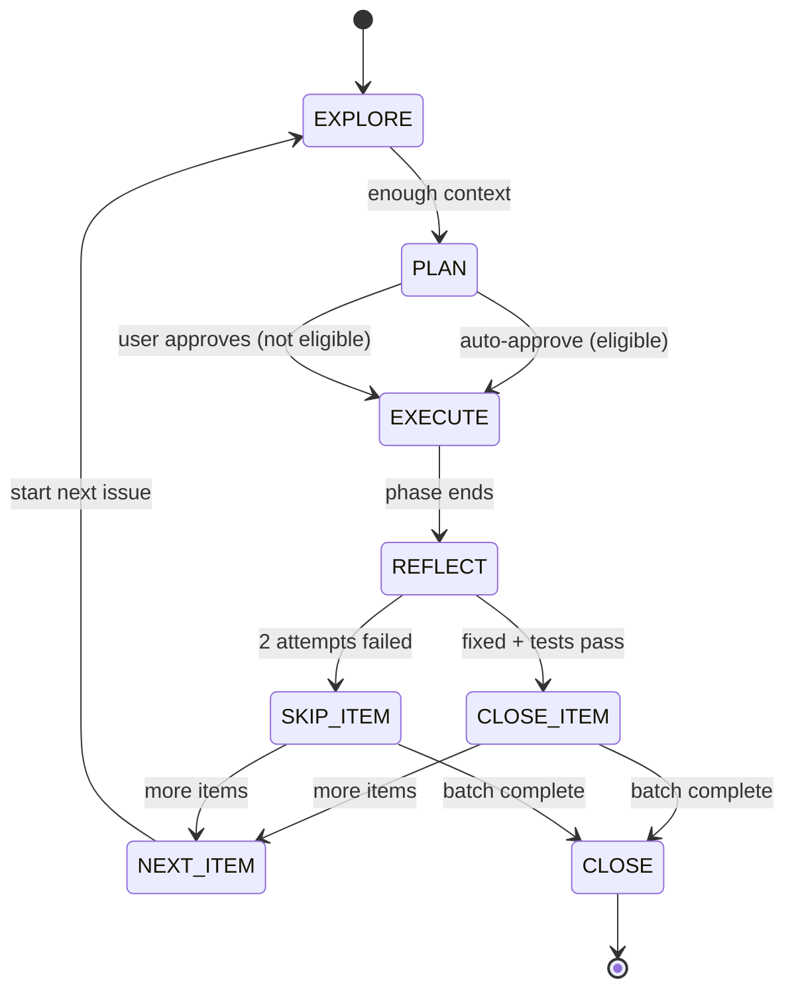

# Autonomous Batch Mode

> Extracted from SKILL.md. For unattended multi-issue fix sessions (e.g., red team audits, bulk bug fixes).

## Activation

**Trigger phrases**: *"fix these autonomously"*, *"audit loop"*, *"turbo mode"*, *"run unattended"*, *"batch fix"*

The user provides a list of issues. The agent creates `{plan-dir}/batch.md` and works through them sequentially.

## Batch State Machine

## Auto-Approval Criteria

A plan is auto-approved (no user confirmation needed) when ALL are true:

| Criterion | Threshold |
|-----------|----------|
| Files modified | ≤ 3 |
| New abstractions | 0 |
| Net new lines | ≤ 30 |
| Irreversible ops | None |
| Complexity budget | Within budget |

If ANY criterion fails → **stop and request user approval** for that item.

## Safety Rails (ALL preserved)

| Rail | Active | Notes |
|------|--------|-------|
| Revert-First | ✅ | Always |
| 10-Line Rule | ✅ | Always |
| 2 fix attempts per step | ✅ | On failure: SKIP item, not STOP batch |
| 3-Strike Rule | ✅ | Triggers batch STOP |
| Complexity Budget | ✅ | Per-item |
| Regression tests | ✅ | Every fix must add ≥1 test |
| No irreversible ops without approval | ✅ | Always ask |

## Skip vs Stop

- **SKIP**: the item is too complex for autonomous fix. Revert changes, log reason in `batch.md`, move to next item.
- **STOP**: systemic issue detected. Halt entire batch, present `batch.md` to user.

**Stopping conditions** (entire batch halts):
- 3-Strike Rule triggered (same area failing repeatedly)
- ≥50% of items skipped (pattern suggests deeper problem)
- User sends a message (immediate stop)
- Per-item iteration limit hit (6)

## Batch Tracking (`batch.md`)

Create at batch start. Update after each item. Template in `references/file-formats.md`.

## End of Batch

At batch completion:
1. Present `batch.md` summary to user
2. List fixed items with regression tests added
3. List skipped items with recommendations
4. Run full test suite
5. Commit all fixes: `[batch] Fixed N/M issues from audit`
6. Proceed to CLOSE (update knowledge base with learnings from the batch)
