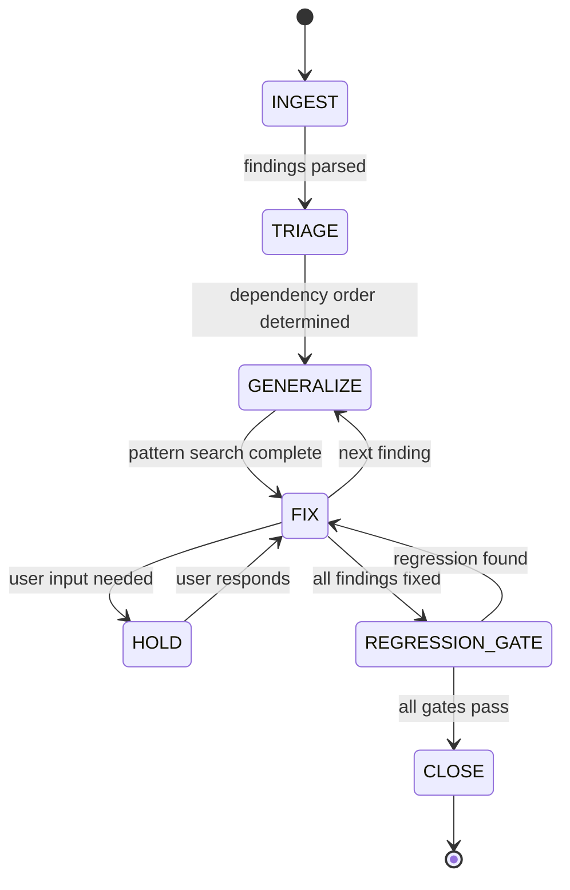

# Red Team Remediation

**Core Principle**: Fix the pattern, not the instance. Test the invariant, not the fix.

Every audit-fix cycle that causes regressions shares the same failure modes:
1. **Narrow fixes** — fix 1 of N instances of the same anti-pattern
2. **No blast-radius analysis** — change shared code without mapping dependents
3. **Tests guard the fix, not the invariant** — test passes, but invariant still violable elsewhere
4. **Arbitrary ordering** — fix symptoms before root causes, so root-cause fixes invalidate earlier work
5. **No generalization** — each finding treated in isolation

This skill prevents all five.

## When to Use This

| Situation | Use |
|-----------|-----|
| Red team audit report with 3+ findings | **Red Team Remediation** |
| Post-audit remediation that has already caused regressions | **Red Team Remediation** |
| Systematic codebase hardening (security, integrity, performance) | **Red Team Remediation** |
| Single finding, clear fix, no shared code | **Iterative Planner** (standard) |
| Non-audit work (features, refactors) | **Iterative Planner** or **Lightweight** |

**Trigger phrases**: *"red team this"*, *"fix this audit"*, *"remediate these findings"*, *"process this audit report"*, *"harden against this"*

## Relationship to Iterative Planner

This skill **wraps** the iterative planner. It adds 3 phases before and 1 phase after:

```
┌─────────────────────── Red Team Remediation ───────────────────────┐
│                                                                     │
│  INGEST → TRIAGE → ┌─── per-finding loop ───┐ → REGRESSION-GATE   │
│                     │ GENERALIZE             │                      │
│                     │ ↓                      │                      │
│                     │ ITERATIVE PLANNER      │                      │
│                     │ (EXPLORE→PLAN→EXECUTE  │                      │
│                     │  →REFLECT→CLOSE)       │                      │
│                     └────────────────────────┘                      │
│                                                                     │
└─────────────────────────────────────────────────────────────────────┘
```

**Filesystem**: Uses `plans/` (same as iterative planner). Remediation-specific files (`triage.md`, `blast-radius.md`, `generalization-log.md`, `scorecard.md`) live in `{plan-dir}/`.

**Iterative planner activation**: Each finding enters the iterative planner's standard state machine. The iterative planner's SKILL.md rules (mandatory re-reads, autonomy leash, complexity control, code hygiene) all apply within the FIX phase.

## Protocol Overview



## Phase 1: INGEST

**Purpose**: Parse the audit report into structured, actionable findings.

### Steps

1. **Read the audit report** — identify each finding.
2. **Parse into structured format** — write `{plan-dir}/triage.md` with one entry per finding:

```markdown
## F-001 | [severity] | [title]
**Code proof**: [files + lines from audit]
**Affected modules**: [list of files]
**Current state**: OPEN
```

3. **Count baseline tests** — run your project's test command and record the starting test count. Write to `triage.md` header.
4. **Capture baseline test results** — run the full test suite and record pass/fail count. Any pre-existing failures are noted as `KNOWN_FAILING`.
5. **Read tech debt register** — read `plans/knowledge/tech-debt.md`. Check if any findings touch areas flagged as structurally fragile. Note in `triage.md`.

6. **Scope Expansion** (MANDATORY) — For each module referenced in the audit findings:
   a. List all files in the **same package** directory.
   b. `grep_search` for all files that import from or are imported by the audited module.
   c. Add discovered files to the audit surface.
   d. For each discovered file, do a 60-second scan: does it contain the same semantic patterns as the audited module? If yes → add to `triage.md` as `[ADJACENCY_REVIEW]`.

   **Why**: Adjacency discovery prevents bugs from hiding in sibling modules that share the same patterns but are never audited.

   e. **Reference script scan** — search for `smoke_*`, `example_*`, `demo_*` files related to the modules in scope. These scripts demonstrate how existing infrastructure is meant to be used and often reveal capabilities that are not obvious from reading exports alone.

### Exit Criteria
- All findings parsed into `triage.md`
- Baseline test count and pass/fail recorded
- Tech debt register consulted
- **Scope expansion complete** — adjacent modules discovered and scanned
- Transition to RECONCILE

---

## Phase 1b: RECONCILE (MANDATORY before TRIAGE)

**Purpose**: Verify each finding against the current codebase. Audit reports may reflect a prior snapshot — findings may already be fixed from earlier rounds.

> [!IMPORTANT]
> **Do NOT skip this phase.** Re-auditing pre-fixed items is the #1 source of wasted effort in multi-round audit cycles.

### Steps

1. **For each finding's "code proof" lines** → view them in the current codebase NOW.
2. If the audited code has changed since the audit → mark finding as `VERIFY_FIX`.
3. Run any existing regression test that covers the area.
4. Assign one of these statuses in `triage.md`:

| Status | Meaning |
|--------|---------|
| `ALREADY_FIXED` | Code has changed AND relevant test passes |
| `PARTIALLY_FIXED` | Some instances fixed, others remain |
| `OPEN` | Audited code is unchanged, bug is live |
| `NO_ACTION` | Finding is valid but non-actionable (e.g., already guarded) |

5. **Heuristic**: If >50% of findings are `ALREADY_FIXED`, drop to **lightweight mode** for the session — use `triage.md` as the plan, skip full iterative planner bootstrap.
6. Only `OPEN` and `PARTIALLY_FIXED` findings enter TRIAGE.

### Triage Status Update Triggers

Status MUST be updated at each of these points:
- After RECONCILE: `OPEN` | `ALREADY_FIXED` | `PARTIALLY_FIXED` | `NO_ACTION`
- After each FIX: `FIXED` with commit hash
- After REGRESSION-GATE: final status sweep (verify no status drift)

### Exit Criteria
- Every finding has a reconciliation status with evidence
- Only genuinely open findings proceed to TRIAGE
- Transition to TRIAGE

---

## Phase 2: TRIAGE

**Purpose**: Determine the fix order that minimises regressions. This is the key anti-regression phase.

### Step 2a: Dependency Tracing

For each OPEN/PARTIALLY_FIXED finding's affected files, trace the true dependency graph. Text searches (grep) often miss generic data passing (kwargs, dataframe columns, dicts).

**Rule**: "To map the blast radius of a variable, deliberately break the variable's name or type in the source code, run the full test suite, and record every single test that crashes. This is your true dependency graph."

Write to `{plan-dir}/blast-radius.md`:

```markdown
## F-001 | [title]
### Affected code
- `src/services/auth.py:45` (vulnerable code path)
### Downstream dependents (blast radius)
- `src/api/users.py` — calls `auth.validate()`
- `tests/test_auth.py` — asserts auth result structure
### Upstream dependencies
- `src/config/settings.py` — provides auth config
### Estimated blast radius: MEDIUM (3 files, 2 test files)
```

Do not rely solely on `grep_search`. Be thorough — missed dependents are the #1 cause of regressions.

**Blast-radius is conditional**:
- **Required**: for CRITICAL findings affecting shared modules (≥5 dependents)
- **Optional**: for findings where blast radius fits in 3 lines of `triage.md` — add a `blast_radius: LOW|MEDIUM|HIGH` field to the triage entry instead

### Step 2b: Root Cause Ordering

Sort findings by dependency depth:
1. **Root causes first** — if Finding A's code calls code affected by Finding B, fix B first
2. **Shared modules first** — findings in heavily-imported modules before leaf modules
3. **Higher severity first** (within same depth tier)

Write the ordered fix sequence to `triage.md`:

```markdown
## Fix Order
| Priority | Finding | Reason |
|----------|---------|--------|
| 1 | F-003 | Root cause: shared module (src/core/) |
| 2 | F-001 | Depends on F-003's output |
| 3 | F-002 | Independent, shared module (src/api/) |
| 4 | F-004 | Leaf-level (src/handlers/) |
| 5 | F-005 | Minor / hygiene |
```

### Step 2c: Category-Based Execution Mode

Assign each finding an execution mode:

| Severity | Execution Mode | Approval |
|----------|---------------|----------|
| CRITICAL | Full iterative planner | User must approve plan |
| SIGNIFICANT | Full iterative planner | User must approve plan |
| MINOR | Batch mode (auto-approve if ≤3 files, ≤30 lines, 0 abstractions) | Auto-approve eligible |

### Exit Criteria
- Dependency graph complete for all findings
- Fix order determined and justified
- Execution modes assigned
- Transition to GENERALIZE (for first finding in fix order)

---

## Phase 3: GENERALIZE (per-finding, before fix)

**Purpose**: Ensure you fix the pattern, not just the instance. This phase runs once per finding, immediately before the FIX phase.

### Steps

1. **Extract the anti-pattern** — define what's wrong in abstract terms:
   - ❌ Bad: "Remove the hardcoded value from line 45 of `auth.py`"
   - ✅ Good: "No authentication check shall rely on client-side-only validation"

2. **Pattern search** — search the ENTIRE codebase for the same anti-pattern:
   ```
   # Example: search for all hardcoded secrets
   grep -rn "password\|secret\|api_key" --include="*.py" --include="*.ts" --include="*.js"
   ```

3. **Record all instances** — write to `{plan-dir}/generalization-log.md`:

```markdown
## F-001 | [title]
### Anti-pattern
[Description of the anti-pattern in abstract terms]
### Invariant
[What must always be true]
### Instances found
| File | Line | Context | Status |
|------|------|---------|--------|
| src/auth.py | 45 | hardcoded check | ALREADY_FIXED (per audit) |
| src/api/validate.py | 67 | same pattern | OPEN |
| src/middleware/cors.py | 123 | similar bypass | OPEN (NEW - not in audit) |
```

4. **Scope expansion** — if new instances found beyond the audit report, add them to `triage.md` as sub-findings under the parent.

5. **Silent Degradation Scan** (MANDATORY) — search for conditional behavior that degrades to a no-op without warning:
   a. For each config parameter that gates runtime behavior, trace the code path.
   b. If the behavior silently does nothing when a prerequisite is missing (no warning, no error), flag it.
   c. For each silent no-op found, determine if it should:
      - Emit a warning (development/exploration context)
      - Raise an error (production/critical context)
      - Be documented as intentional (with explicit `# INTENTIONAL_NOOP` comment)

5b. **Page Load State Persistence Scan** (MANDATORY for frontend UI changes) — verify that refreshing the page mid-state or loading with URL parameters/hashes does not trigger unintended side effects:
    a. Does the code execute unconditionally on load when it was only meant for user interaction?
    b. Does it lock the UI state (e.g., `isScrolling = true`, modal overlays)?
    c. How does the browser natively handle the hash/parameter, and does custom JS conflict with it?


6. **Optimization Adequacy Scan** (MANDATORY for quant/model/strategy findings) — if a finding involves Optuna, hyperparameter search, model-family comparison, strategy selection, staking optimization, or profitability claims from an optimizer artifact:
   a. Count the optimizer's unique parameter names and active parameters per trial where the code/artifacts expose them.
   b. Count model families, policy/strategy families, calibration methods, feature-selection branches, RAVEN/risk modes, and objective choices.
   c. Compare completed trials against the conditional search surface. Flag any report that treats a smoke or wiring-proof run as profitability evidence.
   d. Verify the objective was frozen for a serious search, or that sampled objectives are reported as separate exploratory evidence.
   e. Require the final report to label the run class and state what remains under-searched before recommending parameter changes.

7. **Planner-Core Contract Packet** (MANDATORY for planner-on-planner findings) — if the finding touches `.agent/skills/iterative-planner/`, `.agent/workflows/`, or `.agent/rules.md` and the failure smells like a gate/parser/markdown/ontology mismatch, capture the deterministic packet before choosing a fix:
   - `node <skill-path>/scripts/verify_gate.mjs <gate> --plan <plan-dir>`
   - `node <skill-path>/scripts/planner_findings.mjs --dir <repo-root> --plan <plan-dir> --gate <gate> --json`
   - `_PLANNER_PLAN_TARGET=<plan-dir> node <skill-path>/scripts/ontology_serializer.mjs --json`
   - The exact `plan.md` / `verification.md` section named by the failing gate
   - An inventory of every runtime consumer of the same artifact/helper/fact, labeled `writer`, `canonical_reader`, or `mirror_reader`

   Then classify the problem as missing artifact, stale integrity, parser normalization, or JS/Prolog divergence. Do not patch planner prose first just because the failure is rendered through markdown. Do not stop at the first parser hit if a mirror consumer still reads the same contract.

   For blocked PLAN gates, read the `Low-Level Agent Gate Packet` printed by `verify_gate.mjs plan-to-execute` and treat it as the remediation checklist for smaller agents. It should cover intent schema shape, story IDs, synthesis labels, matrix columns, and lint commands; if it does not, fix the packet surface rather than adding more prompt text.

   For parser or artifact-reader findings, choose the smallest real regression fixture that still satisfies unrelated gates. Include realistic authored shapes from the incident: table/list variants, natural proof prose, compact labels, and the non-mutating diagnostic CLI. Do not rely only on canonical tokens such as exact `proof:*` IDs. Avoid planner-core file paths or synthetic `close_signals` unless planner-core proof or close-signal serialization is the subject of the finding.

8. **Define the invariant test** — write the test assertion in abstract terms:
   ```
   INVARIANT: For all API endpoints, authentication must be verified
   server-side before any data mutation occurs
   ```

9. **Cross-Invariant Conflict Scan** (MANDATORY) — For any new invariant (hard-fail assertion, `raise`, `assert`), search for code that actively works AGAINST the invariant:
   - New invariant requires a field → search for code that removes/drops it
   - New invariant requires value > 0 → search for code that sets it to 0 or None
   - New invariant requires sorted data → search for shuffles or random reordering

   **Anti-pattern**: "X is required" + "X is removed upstream" = invariant collision. The fix belongs in the remover, not the checker.

   > [!WARNING]
   > Always search for both USES of a value and code that REMOVES it. Invariant collisions happen when two safety measures work against each other.

### Exit Criteria
- Anti-pattern defined in abstract terms
- Full codebase search completed (all instances found)
- **All call-sites documented** — log every caller in `triage.md`, even unchanged ones
- **Silent degradation scan complete** — no unwarned no-ops remain
- **Cross-invariant conflict scan complete**
- **Documentation-wiring scan** — if the fix adds new scripts, CLI commands, or directories: verify they are documented in SKILL.md and referenced by relevant workflows. Undocumented capabilities are invisible to the agent and will never be used.
- **Report-consistency scan** (Retro 2026-03-22) — when fixing a defect, `grep -r "D-NNN"` and `grep -r "F-NNN"` across all `reports/` files. Every reference to the defect must agree with its status in `defect_register.md`. Check `story_registry.json` for stale `open_gaps` and `blocked_by` entries that reference fixed defects. Run `rule_engine.mjs check-invariants` to catch mismatches via I-009/I-010/I-011.
- Invariant defined
- Generalization log updated
- Transition to FIX (iterative planner loop)

### Blocking Mechanism Gate (MANDATORY)

> [!CAUTION]
> **Before writing ANY blocking/deprecation code**, you MUST consult the Blocking Mechanism Decision Table (see section below).

**Gate checklist** (all must be checked before writing a fix that blocks/deprecates a class or function):
- [ ] Grepped `ClassName(` across ENTIRE codebase (including tests)
- [ ] Counted instantiation sites: `___` total (`___` in tests, `___` in production)
- [ ] Selected mechanism from decision table: `___`
- [ ] Logged choice in `decisions.md`

---

## Phase 4: FIX (iterative planner loop, per-finding)

**Purpose**: Fix all instances of the finding using the iterative planner, with TDD and full-suite regression gates.

### Integration with Iterative Planner

Bootstrap a new iterative planner plan (or use the current one if already active):
```bash
node <skill-path>/../iterative-planner/scripts/bootstrap.mjs new "Fix F-001: [title]"
```

Then follow the standard iterative planner protocol with these **additional constraints**:

### Constraint 0: Plan Traceability Gate

If the active remediation plan uses `## Success Criteria` and the repo has `reports/user_story_audit/story_registry.json`, the plan must declare explicit criterion-to-story mappings before heavy execution starts.

Run:
```bash
node <skill-path>/../iterative-planner/scripts/verify_gate.mjs plan-to-execute
```

If the gate reports missing criterion/story linkage, stop and fix `plan.md` first. The `Verification Strategy` should use a table with `Criterion | Story linkage | Check | Pass means`.

> [!CAUTION]
> Do **not** rely on `Files To Modify` overlap heuristics as your primary remediation traceability story. Heuristic overlap is fallback-only; deliberate story linkage belongs in the plan.

### Constraint 1: Test-Before-Fix (TDD Mandate)

**Before writing any fix code**, write the invariant test:

1. Write a test that asserts the invariant from the GENERALIZE phase
2. Run it — it MUST FAIL (proving the bug exists)
3. If it passes → the bug may already be fixed, or the test is wrong. Investigate.
4. Only after the test fails → write the fix
5. Run the test again — it MUST PASS
6. Commit the test and fix together

### Constraint 2: Full-Suite Regression Gate

After EVERY fix (not just the finding, every individual code change):

Run your full test suite.

| Result | Action |
|--------|--------|
| All tests pass (including new) | ✅ Proceed to next step |
| New test fails | Bug in the fix. Revert and retry. |
| Pre-existing test fails that wasn't failing before | 🛑 REGRESSION. Revert immediately. Analyse why. |
| Pre-existing test fails that was already failing (KNOWN_FAILING) | ⚠️ Note but proceed |

**Zero tolerance for new regressions.** If a fix causes a regression:
1. Revert the fix immediately
2. Analyse the coupling between the fix and the regressed test
3. The regression becomes a new sub-finding — add to `triage.md`
4. Re-enter GENERALIZE for the expanded scope

### Constraint 2b: Keep planner artifacts gate-ready during the fix loop

Do not defer planner closeout hygiene until the end of remediation.

- Keep `progress.md` in checkbox form as findings move through the loop.
- Update `red_team_notes.md` as soon as new attack vectors become clear, rather than writing all vectors at the end.
- Accumulate verification evidence in `verification.md` under `## Test Drift Scan`, `## Regression Audit`, `## Parity`, and `## Proof of Work` as commands are run.
- `## Proof of Work` must contain real fenced command output or the explicit marker `UNVERIFIED: Requires manual user validation`.

This prevents the remediation from being operationally done but still blocked by iterative-planner gate formatting at REFLECT/CLOSE.

### Constraint 3: Fix All Instances

The plan from the iterative planner must cover ALL instances found in the GENERALIZE phase, not just the one mentioned in the audit report.

### Constraint 4: Commit Discipline

Each fixed finding gets its own commit:
```
[red-team/F-001] [title of fix]

- Fixed in: [list of files]
- Invariant test: [test name]
- Full suite: N/N pass (X new tests added)
```

### Auto-Stop Conditions (per-finding)

The iterative planner's standard autonomy leash applies, plus:
- **User hold**: If the fix requires a design decision not covered by the audit report → HOLD. Present the decision to the user.
- **Cascade detection**: If fixing this finding would require changing the fix from a PREVIOUS finding → HOLD. Present the conflict.
- **Scope explosion**: If GENERALIZE found >10 instances → HOLD. Confirm with user before proceeding.

### Exit Criteria
- All instances of the finding fixed
- Invariant test written and passing
- Full test suite passing (no regressions)
- Committed with descriptive message
- Finding marked `FIXED` in `triage.md`
- Proceed to GENERALIZE for next finding in fix order (or REGRESSION-GATE if all done)

---

## Phase 5: REGRESSION-GATE (after all findings fixed)

**Purpose**: Final validation that the complete set of fixes is coherent and regression-free.

Before running the final gate, confirm the iterative-planner artifacts are already current: no stale unchecked work remains in `progress.md`, `red_team_notes.md` is substantive, and `verification.md` already contains the proof-of-work/regression evidence gathered during the loop. REGRESSION-GATE should validate the accumulated evidence, not backfill it from memory.

### Gate 1: Full Test Suite
Run your full test suite.
- Must pass. Any failure → investigate (is it pre-existing or new?).

### Gate 1b: Mirror-Consumer Proof
For shared artifact, parser, serializer, or fact-emitter fixes, run the primary failing entrypoint plus at least one secondary runtime consumer on the same success phrasing.
- Example: `verify_gate.mjs` passes and `rule_engine.mjs check-transition` still passes on the same `verification.md` fixture.
- For markdown/table parser fixes, one proof must use realistic authored prose or table structure from the incident, and one proof must use the diagnostic CLI that exposes parsed rows/criteria.
- Any mirror consumer disagreement → back to GENERALIZE. The bug is still a contract split, not a closed finding.

### Gate 2: Test Count Verification
- Final count must be ≥ baseline count + (number of findings fixed)
- Each finding must have added ≥1 invariant test

### Gate 3: Scorecard

Write `{plan-dir}/scorecard.md`:

```markdown
# Red Team Remediation Scorecard

## Audit: [audit title]
## Date: [date]

## Baseline
- Tests at start: [N]
- Tests passing at start: [N]
- Known failing: [list]

## Results
| Finding | Severity | Status | Tests Added | Regressions Caused | Instances Fixed |
|---------|----------|--------|-------------|--------------------|------------------|
| F-001 | CRITICAL | ✅ FIXED | 2 | 0 | 3 (1 in audit + 2 from GENERALIZE) |
| F-002 | SIGNIFICANT | ✅ FIXED | 1 | 0 | 1 |
| F-003 | MINOR | ⏭️ DEFERRED | 0 | — | — |

## Final State
- Tests at end: [N] (+X from baseline)
- Tests passing: [N]
- New regressions introduced: 0

## Generalization Yield
- Instances in audit report: [N]
- Additional instances found by GENERALIZE: [M]
- Total instances fixed: [N+M]

## Knowledge Base Updates
- Mistakes added: [list]
- Patterns added: [list]
- Gotchas added: [list]
```

### Gate 4: Plan Traceability Regression Check

If the repo has `story_registry.json` and the active plan uses success criteria:
- Re-run `node <skill-path>/../iterative-planner/scripts/verify_gate.mjs plan-to-execute`
- Re-run `node <skill-path>/../iterative-planner/scripts/rule_engine.mjs check-invariants`
- Confirm the remediation did not leave a heuristic-only criterion/story mapping that will fail later at CLOSE

This gate treats planner-contract regressions as real regressions, not documentation polish.

### Exit Criteria
- All gates pass
- Scorecard written
- Proceed to CLOSE

> [!IMPORTANT]
> **Scorecard/Walkthrough Merge (ALWAYS)**: The scorecard MUST be embedded as a section in `walkthrough.md` rather than a separate `scorecard.md` file. Separate files get skipped.

---

## CLOSE

Follow the iterative planner's standard CLOSE protocol:
1. Write `summary.md`
2. Update knowledge base (`plans/knowledge/`)
3. **Update tech debt register** — write any structural fragility to `plans/knowledge/tech-debt.md`. Future audits MUST read this file during INGEST.
4. Merge findings/decisions to consolidated files
5. Present scorecard to user

---

## File Structure

```
plans/plan_YYYY-MM-DD_XXXXXXXX/
├── state.md                  # Standard iterative planner
├── plan.md                   # Standard iterative planner
├── decisions.md              # Standard iterative planner
├── findings.md               # Standard iterative planner
├── findings/                 # Standard iterative planner
├── progress.md               # Standard iterative planner
├── verification.md           # Standard iterative planner
├── checkpoints/              # Standard iterative planner
├── summary.md                # Standard iterative planner
├── triage.md                 # NEW: Parsed findings + fix order
├── blast-radius.md           # NEW: Dependency graph per finding
├── generalization-log.md     # NEW: Pattern search results per finding
└── scorecard.md              # NEW: Final remediation scorecard
```

---

## Mandatory Re-reads

In addition to the iterative planner's mandatory re-reads:

| When | Read | Why |
|------|------|-----|
| Before starting each finding | `triage.md` | Confirm fix order, check for new sub-findings |
| Before GENERALIZE | `blast-radius.md` | Know what could break |
| Before each code change in FIX | `generalization-log.md` | Ensure ALL instances are being addressed |
| After any regression | `scorecard.md` (if started), `triage.md` | Check if pattern suggests stopping |

---

## Auto-Stop Conditions (entire remediation)

| Condition | Action |
|-----------|--------|
| ≥3 regressions caused across all findings | 🛑 STOP. Present pattern to user. |
| Any fix requires changing a previous fix | 🛑 HOLD. Present the conflict. |
| ≥50% of findings deferred/skipped | 🛑 STOP. Systemic issue. |
| User sends a message | 🛑 Immediate stop. |
| Finding requires design decision beyond audit scope | 🛑 HOLD. Present options. |

---

## Session Continuity Protocol

When resuming remediation in a new conversation:

1. **Read `triage.md`** — check finding statuses (which are FIXED, OPEN, SKIPPED?)
2. **Read `scorecard.md` or walkthrough** — check progress metrics
3. **Run full test suite** — establish current baseline
4. **For each "OPEN" finding** → verify it's genuinely open (code may have changed between sessions)
5. **Resume from the first genuinely OPEN finding** in the fix order

> [!TIP]
> Multi-session audits are common. The triage file is the single source of truth for audit state. Never rely on conversation memory across sessions.

---

## Blocking Mechanism Decision Table

This table MUST be consulted before ANY fix that blocks or deprecates a code path. It is referenced by the Blocking Mechanism Gate in Phase 3.

| Situation | Mechanism | Why |
|-----------|-----------|-----|
| No tests construct the blocked class | Unconditional `raise` in constructor | Simplest, no test impact |
| Tests construct the blocked class for sub-component testing | Conditional gate with test-only bypass | Preserves test infra while blocking production |
| Class is used in many tests as a test vehicle | Move `raise` to the dangerous method, not constructor | Allows construction but blocks execution |
| Gradual deprecation | `DeprecationWarning` + env-var gate | Gives callers time to migrate |

> [!CAUTION]
> **Never use unconditional `raise` in a constructor without first grepping for ALL instantiation sites.** Always grep `ClassName(` across the entire codebase before choosing the blocking mechanism.

---

## Retrospective Execution Gate

When a retrospective or improvement analysis identifies changes to this skill:

1. **Implement the changes IN THIS FILE immediately** — do not create a separate document
2. **Commit** with message: `[skill/red-team] <description of improvement>`
3. The improvement IS the commit. A retrospective that produces only a document is incomplete.

---

## Knowledge Base Notification Gate (MANDATORY)

> [!CAUTION]
> This gate blocks the final `notify_user`, walkthrough, or scorecard presentation. You may NOT present results to the user until all boxes are checked.

Before presenting any results to the user, verify:

- [ ] Read `plans/knowledge/mistakes.md` — checked for relevant past mistakes before each fix
- [ ] Read `plans/knowledge/patterns.md` — applied known patterns where applicable
- [ ] Read `plans/knowledge/gotchas.md` — avoided known traps
- [ ] Mistakes from this session: [added entries / no new mistakes]
- [ ] Patterns from this session: [added entries / no new patterns]
- [ ] Gotchas from this session: [added entries / no new gotchas]
- [ ] Tech debt: [updated / not applicable]

If `plans/knowledge/` doesn't exist, embed learnings in `walkthrough.md` under `## Lessons Learned`.

---

## References

- `../iterative-planner/SKILL.md` — the underlying iterative planner protocol (all rules apply within FIX phase)
- `../iterative-planner/references/file-formats.md` — templates for triage, blast-radius, generalization-log, scorecard
