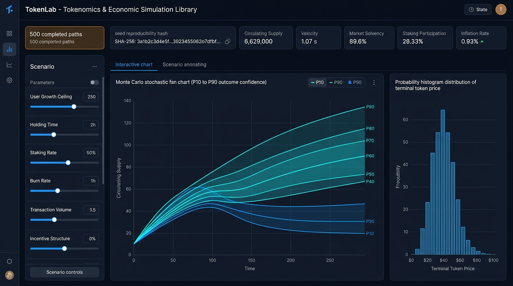
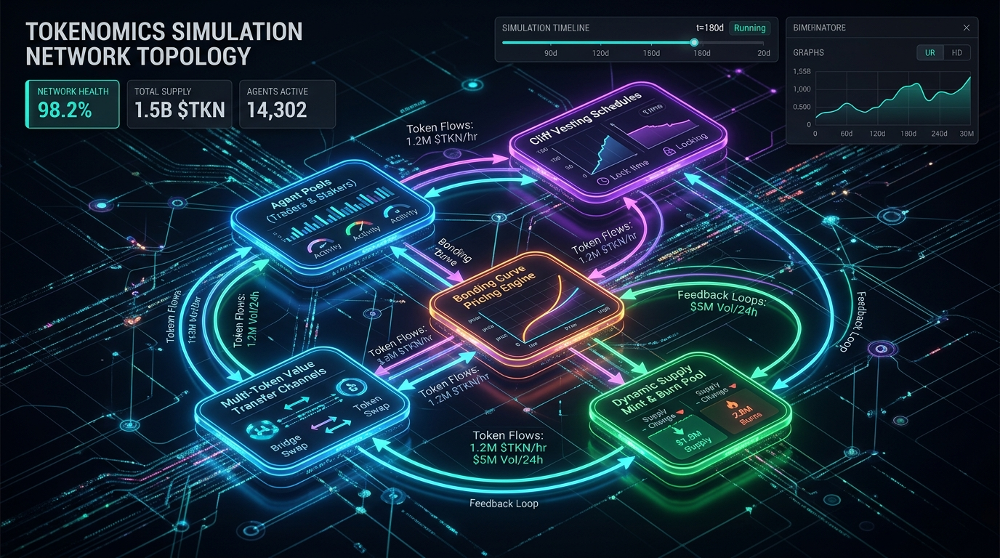

# TokenLab: Agentic Tokenomics & Economic Simulation Framework

<p align="center">
  <a href="https://tesseract.academy">
    
  </a>
</p>

<p align="center">
  <a href="https://python.org"></a>
  <a href="LICENSE"></a>
  <a href="pyproject.toml"></a>
  <a href="#-why-agentic-tokenomics"></a>
  <a href="#-interactive-scenario-gallery"></a>
</p>

<p align="center">
  <strong>Move beyond fragile spreadsheets to autonomous agent simulation.</strong><br />
  TokenLab is the AI-native framework for modeling complex token economies, market incentives, and multi-token ecosystems through agent-based dynamics and Monte Carlo stress-testing.
</p>

<p align="center">
  
</p>

---

## 💡 Why Agentic Tokenomics?

Traditional tokenomics relies on static spreadsheets and naive linear projections. But crypto economies are **complex adaptive systems** driven by dynamic human and algorithmic behaviors.

```
❌ Old Way (Static Spreadsheets)       👉  🚀 TokenLab (Agentic Tokenomics)
• Rigid cell formulas & static math       • Autonomous agent cohorts (traders, stakers, whales)
• Single-point guessed estimates          • Monte Carlo stochastic uncertainty (P10–P90 fan bands)
• Zero behavioral feedback loops          • Dynamic bonding curves, fee sinks & liquidity channels
• Blind to black-swan liquidity cascades  • Automated stress-testing & statistical solvency checks
• Manual, error-prone maintenance         • Declarative YAML specs ready for AI agent orchestration
```

---

## ⚡ Capabilities At-A-Glance

| Feature | Description |
| :--- | :--- |
| 🤖 **Autonomous Agent Cohorts** | Model competing cohorts—arbitrageurs, long-term stakers, speculative traders, and treasury controllers—with emergent behavioral dynamics. |
| 🎲 **Monte Carlo Uncertainty Engine** | Run hundreds of stochastic paths with prior distributions, P10–P90 modeled outcome fan charts, terminal histograms, bootstrap CIs, and Spearman sensitivity ranking. |
| 📊 **Interactive Web Studio** | Standalone, offline browser dashboard (`tokenlab-dashboard --gallery`) for visual scenario execution, metric comparison, and evidence downloads. |
| 🌐 **Scenario Topology Graphs** | Interactive visual maps of economy components, cliff-vesting pools, bonding curves, and inter-token value transfer channels. |
| ⚙️ **AI-Agent Declarative Workflows** | Data-only YAML scenario definitions designed for LLMs and AI agents to design, simulate, and optimize economies autonomously. |
| 📁 **20+ Battle-Tested Case Studies** | Client-grade simulation models included in `projects/` (*friendocash*, *footboard*, *andromeda*, *kix*, *valiants*, *z1*, etc.). |

<p align="center">
  
</p>

---

## 🚀 30-Second Quickstart

### 1. Install TokenLab
```bash
python -m pip install .
```

### 2. Launch the Interactive Studio
```bash
tokenlab-dashboard --gallery --output-dir outputs/demo-gallery
```
*Open `http://127.0.0.1:8765` in your browser to run live Monte Carlo simulations and explore scenario topologies.*

### 3. Run a One-Line CLI Simulation
```bash
tokenlab-demo public-growth-uncertainty-v2 --run-tier fast --output-dir outputs/demo
```

---

## 🏛️ Bundled Scenarios & Archetypes

TokenLab comes pre-packaged with **12 reviewed public scenarios**:

| Scenario ID | Category | Type | What It Simulates |
| :--- | :---: | :---: | :--- |
| **`public-growth-uncertainty-v2`** | 🌟 Flagship | Stochastic | **Monte Carlo Growth**: Live stochastic prior sampling, fan charts, bootstrap CIs & Spearman sensitivity. |
| **`growth-path`** | 🛡️ Control | Deterministic | **Deterministic Baseline**: Zero-variance negative control isolating model mechanics. |
| **`public-vesting-concentrated-v2`** | 🔓 Vesting | Stochastic | 5-pool cliff allocation with concentrated 1–3 period unlock bursts. |
| **`public-vesting-smoothed-v2`** | 🔓 Vesting | Stochastic | Identical 5-pool allocation with smoothed 12–24 period unlocks (isolating unlock pacing). |
| **`public-demand-history-v2`** | 📈 Demand | Stochastic | Synthetic logistic rise & plateau demand replay under price noise uncertainty. |
| **`public-staking-rewards-v3`** | 🥩 Staking | Stochastic | Minted token dilution and staker lockup under participation uncertainty. |
| **`public-multitoken-dependency-v3`** | 🌐 Multi-Token | Stochastic | Two-economy ecosystem (master MTLB + dependent MTDB) linked via value-transfer channels. |
| **`z1-solvency-adapted-v1`** | 🏛️ Solvency | Adapted | Precomputed canonical baseline & stable solvency evidence adapted from the Z1 framework. |
| **Controls (`constant-v1`, `disconnected`)** | 🛡️ Controls | Deterministic | Paired zero-variance negative controls for honest scientific comparison. |

---

## ⚙️ AI & Declarative Scenario Execution

Run end-to-end simulations directly from pure YAML/JSON definitions with zero boilerplate code:

```bash
python -m TokenLab.agentic.runner \
  examples/scenarios/notebook_01_simple_fiat.yaml \
  --output-dir outputs/agentic \
  --run-id quickstart
```

Every run generates an immutable, tamper-evident evidence bundle:
* 📄 `manifest.json`: Scenario hash, seed lineage, and output checksums.
* 📊 `results.csv` & `parameter_samples.csv`: Raw path-by-path simulation data.
* 📈 `iteration_summary.csv`: Step-by-step summary statistics.
* 🔍 `diagnostics.log`: Detailed execution and convergence logs.

---

## 🔧 Unified CLI for Client Projects (`tokenlab`)

Execute turnkey simulations from the `projects/` directory or custom workspaces:

```bash
# List all available simulation projects
tokenlab --list

# Run a headless simulation
tokenlab --project friendocash

# Run in interactive mode with desktop plot popups
tokenlab --project friendocash --interactive
```

---

## 📂 Repository Layout

```text
TokenLab/
├── src/TokenLab/               # Core agentic simulation framework & web studio
│   ├── simulationcomponents/   # Agent pools, supply curves, pricing, transactions
│   ├── analytics/              # Econometric & statistical post-processing
│   ├── agentic/                # Declarative scenario runner & demo registry
│   ├── dashboard.py            # Local offline studio server
│   └── cli.py                  # Unified project runner CLI
├── projects/                   # 20+ real client tokenomics simulation models
├── notebooks/                  # Step-by-step tutorial Jupyter notebooks
├── examples/scenarios/         # Declarative YAML scenario specifications
├── resources/assets/           # Dashboard previews and topology graphics
├── docs/                       # Presenter guide (docs/public-demo.md) & architecture docs
└── pyproject.toml              # Build config, entrypoints, and dependencies
```

---

## ⚠️ Interpretation Boundary

All bundled public demos are illustrative and uncalibrated. Deterministic controls demonstrate model mechanics without claiming dispersion; stochastic demos sample illustrative priors and report modeled outcome intervals (not price forecasts). TokenLab simulations do not constitute financial, investment, legal, or launch advice. Live economic systems require qualified domain review.

See the [Three-Minute Presenter Guide](docs/public-demo.md) for the recommended demonstration flow and talk track.

---

## 🤝 Contact & Collaboration

Developed by **Dr. Stylianos Kampakis (PhD, CStat)** and the research team at **Tesseract Academy**:

- **Dr. Stylianos Kampakis**: [Contact Dr. Kampakis](https://thedatascientist.com/contact-dr-kampakis/)
- **Tesseract Academy Research**: [Contact Tesseract Academy](https://tesseract.academy/contact/)

---

<p align="center">
  <sub>TokenLab is open-source software advancing quantitative economic systems and agentic tokenomics.</sub>
</p>

