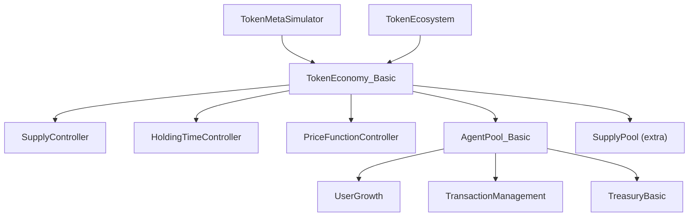

# TokenLab Architecture Overview

## Overview

**TokenLab** is a Python library designed for simulating token economies in Web3/blockchain projects using agent-based models. It provides a robust, modular framework allowing developers and tokenomics researchers to test various assumptions over multi-iteration simulations.

| Metric | Detail |
|--------|--------|
| Core modules | 10 source files |
| Abstraction Level | Cohort-based/Aggregate modeling (as opposed to individual agents) |
| Core Dependencies | `matplotlib`, `numpy`, `pandas`, `scipy`, `statsmodels`, `tqdm` |

---

## Architecture Flow

The library follows a strict **Controller → AgentPool → TokenEconomy** composition pattern. Rather than building monolithic scripts, users define decoupled controllers for supply, holding time, transaction management, and pricing, which are then wired into a core `TokenEconomy` simulation loop.

### Components Hierarchy
1. **Core Sandbox**: Subclasses of `TokenEconomy` orchestrate the iteration process. The most common is `TokenEconomy_Basic`.
2. **Pools**: `AgentPool` (for grouping transactions and user growth) and `SupplyPool` (for segregating token issuance).
3. **Controllers**: Components representing logic blocks (e.g. `HoldingTimeController`, `PriceFunctionController`, `SupplyController`, `UserGrowth`).

---

### Execution Lifecycle

The `TokenEconomy_Basic.execute()` method dictates the simulation's iterative heartbeat:
1. **Supply Updates**: Runs all `SupplyControllers` and `SupplyPools` to calculate the newly available supply.
2. **Holding Time Calculation**: Updates current holding times using the specified `HoldingTimeController`.
3. **Transaction Volume (Agent Pools)**: Invokes all `AgentPools` to calculate new users, agent exits, and aggregate transactional volume (in token and fiat terms).
4. **Price Update**: Recalculates token value given transaction demand, available supply, and holding time (e.g., using Equation of Exchange).
5. **State Storage**: Appends the local iteration dictionary to the persistent simulation state layer.

---

## Key Design Decisions

- **Intermediate Abstraction Level**: Models aggregate agent cohorts rather than thousands of individual agents. This significantly increases simulation speed while still preserving behavioral modeling at the cohort level.
- **Controller Pattern**: All functional simulation blocks inherit from an abstract `Controller` base class. Components configure inter-dependencies via a `.link()` mechanism that ensures required connections are mapped before `execute()` is called.
- **Equation of Exchange Pricing**: The default and most robust pricing logic utilizes `PriceFunction_EOE` ($M \cdot V = P \cdot T$), though bonding curves and predictive linear regression alternatives exist.
- **Monte Carlo Ready Harness**: The `TokenMetaSimulator` wraps single simulation economies to execute $N$ deep-copied repetitions, producing structured `pandas.DataFrame` distributions of output values for statistical confidence testing.

---

## Extensibility & Strengths

1. **Rich Domain Model**: Native abstraction classes exist for realistic tokenomics mechanisms including:
   - **Supply schedules:** Cliff-vesting schedules, adaptive stochastic emission, burn logic.
   - **Staking:** Locking, monthly yields, callable staking vaults.
   - **Treasury Management:** Dual asset conversion with slippage/market impact logic.
2. **Flexible Composability**: `AgentPools`, `SupplyPools`, and controllers are entirely decoupled. For instance, multiple `AgentPools` representing Retail, Whales, and Protocol reserves can be attached to the same economy instance securely.
3. **Lambda-driven logic Add-ons**: The library uses an `Addon` architecture (specifically `Condition`) to easily implement real-time, dynamic pathing without requiring subclassing core modules.
